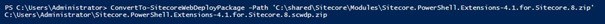
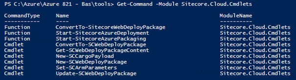

In my previous blogpost I described how the Sitecore Azure Toolkit works and how to create web deploy packages. In this this blogpost I’ll explain how to create your own web deploy package configurations which can be used on Azure and on-premises, even with Sitecore versions older than Sitecore 8.2 update 1. You can apply role specific configurations, or add custom modules like Coveo, PowerShell Extensions, Unicorn, or even one you package up. Using these techniques will help you establish a repeatable process with standard tooling leading to decreased deployment time. How cool would it be to have Continuous Delivery and Deployment all the way to production?! I’ll demonstrate in an example, Sitecore PowerShell Extensions, how to work towards a continuous delivery process. As a bonus I’ll package Unicorn as well – future posts will depend on this example so why not tackle them now.

_special thanks to Rob Habraken, Michael West and Kam Figy who reviewed this post!_

# Use Web deploy to add new functionalities

Deploying Web deploy packages is _the_ way to go to deploy your Sitecore files to Azure and, in my opinion, to your on-premises IIS installation. In the future I will shed light on my thoughts about that subject. A cool feature of web deploy is, is that you can parameterize environment-specific variables for your deployments. In the current WDP’s provided by Sitecore, they have parameterized the Sitecore admin password, database connection strings for core, web and master, basically every parameter that differs on each environment.

When looking from a Helix perspective, the following layers are available.

The current Azure toolkit, provided ARM templates, and web deploy packages allows you to deploy Sitecore + its infrastructure; this makes up the _Foundation_. The _Feature_ and the _Project_ still need to be deployed. One option is to simply FTP the files, however there are some drawbacks to that. Web deploy is surely the way to go. The process to create web deploy packages is fairly straightforward when using the _parameters.xml_ to parameterize your deployments.

There is one “grey” area: Sitecore modules in this Foundational layer.

I truly believe that when you are deploying your projects, you should clear the complete web application site root_,_ redeploy the foundational modules, the features and on top of that the projects. A big challenge with this approach however includes the following:

How should Sitecore module packages be deployed? The use of web deploy packages does not include installation modules such as Sitecore PowerShell Extensions, Coveo, WFFM.

## Difference between initial provisioning and continuous delivery

The _initial_ provisioning of these modules still needs to be performed using the _Installation Wizard_, as web deploy can’t deploy the content of Sitecore packages (yet) and can’t trigger post deployment steps. But when the initial content has been provisioned _and_ the configuration has taken place, the binaries need to be redeployed over-and-over again, there’s no content involved anymore in this process. In the past I saw solutions where people would redeploy these packages using Sitecore ship, which took, in my opinion, too much time; this overhead wasn’t needed at all. But how can we get those files onto the platform without using Sitecore packages? Naturally, Webdeploy is the answer for that ;)

## Create webdeploy packages from Sitecore update packages using the Sitecore Azure Toolkit

The Sitecore Azure toolkit offers the ConvertTo-SitecoreWebDeployPackage cmdlet which let you create web deploy packages from Sitecore module packages:

This is a very basic webdeploy package which quickly can be deployed to your (Azure environment) on top of your Sitecore installation. No parameters can be specified, no config files can be altered. It’s all or nothing. Of course it’s possible to open this zip yourself, alter the configuration files and insert the parameters.xml. Who wants to do that? It’s a very interesting option to use if none of those changes are needed.

An alternative is to create a cargo payload and add it to your Sitecore webdeploy packages. With a small investment of your time you will create modules that can be installed over-and-over again on different environments, without having to alter any of the patch-files anymore.

# A small recap on cargo payloads and configurations

The Sitecore Azure Toolkit provides a PowerShell command to create web deploy packages from existing Sitecore module packages. This command requires configuration files to determine what kind of web deploy packages need to be created. These configuration files point to cargo payloads: small blocks of functionality which can be added to the web deploy packages. Examples include Application Insights binaries, Azure Search functionality settings, or role specific configuration. Of course it’s possible to create own cargo payloads, that can be used in your own configuration.

# How to add your own cargo payload

The cargo payload defines a set of actions/transformations that should be applied on the web deploy package. It’s a file which contains a sccpl extension, “Sitecore Cargo Payload”, and is a standard zip file. The CPL’s that are delivered with the Sitecore Azure Toolkit expose 4 actions:

- **CopyToRoot**: copy files to the root of the web deploy package, such as dacpac files and sql scripts. These are typically files that are needed for provisioning
- **CopyToWebsite**: copies files to the website root – the files will be deployed to the Sitecore web root using webdeploy
- **IOActions**: xml file with actions to enable, disable or delete configuration files.
- **XDTS**: folder with Xml Document Transformation files. These transformations can include changes to the web.config or other xml-files like every file in the include folder

In the common.config and sku config files get defined what CPL should be applied to what role. The common.config is used for _all_ packages, while the sku.config defines the role specific transformations.

## Creating your first cargo payload

Let’s start with the Sitecore PowerShell Extensions module as an example. It contains everything: Content, configuration, binaries and parameters that may differ per environment. We also want to only install it on the CM. It’s a prerequisite for SXA and let’s face it, every solution should make use of it especially for continuous deployment.

The starting point for these foundational modules, which come in the form of Sitecore module packages, is the previously mentioned ConvertTo-SitecoreWebDeployPackage command from the Sitecore Azure Toolkit. It basically takes all the files from the files folder and converts that one to the most basic possible web deploy package:

This package can easily be converted to a Cargo Payload. Create a new folder with the name “BasLijten.PowerShellExtensions” and create a CopyToWebsite folder in it. Drop all the files from the WDP into this folder. That’s it!

## Adding transformations and parameters

The next step would (probably) be to transform it to _your_ needs. It’s important to keep those files as vanilla as possible: this will make future module upgrades easy, Next to that, you need to keep track of your own customizations. By using XDTs (Xml Document transformations) your customizations can be applied on vanilla patchfiles, without having to modify those patchfiles.

The most important question is always: what configuration is _generic_ to my environments and what would be specific to a server/set of servers? In _my_ situation we are hosting multiple Sitecore instances which we want to be configured the same, but have instance specific parameters. To clarify this, I’ll take the security settings for the Sitecore PowerShell Extensions as an example:

I want the the remoting service Enabled and requireSecureConnection to be configurable on each environment (thus specific) and I always want to deny Sitecore\\admin permissions on each server. This means that I should add the **<add Permission="Deny" IdentityType="User" Identity="sitecore\\admin" />** line using XDT (so I am not touching the source) and I should use parameterization for the remoting attribute change.

### The XDT

Inside the BasLijten.PowerShellExtensions folder, create a folder called “XDTS”. To apply an XDT to a patch file simply recreate the same folder/file structure to that file. In this case, the patch file resides at the location “App\_Config\\Include\\Cognifide.PowerShell.Config”. This means that the _same_ folder structure in the XDTS folder needs to be created. To be able to apply the XDT transformation to “Cognifide.PowerShell.Config”, the file “Cognifide.PowerShell.Config.xdt” has to be created in that folder. The transformation will be applied automatically after creating the WDP. For the sake of completeness, this is the XDT that I used:

### The parameters

To be able to disable or enable remoting deployment time, this needs to be a parameterized variable. Please note: you are _not_ working in the CPL folder anymore, but we are going to add a custom configuration. The addition of this parameter is quite easy:

- Make a copy of \\resources\\8.2.1\\msdeployxmls\\xP0.parameters.xml
- Rename this copy to MyFirstWDP.parameters.xml

Upon opening this file you will see a lot of parameter entries in this file. These entries are all definitions for the parameters that should be used:

When watching this file closely , there are entries which are used for SQL, text files and XML files. Let’s take the Cloud Search Connection String as an example:

A parameter with the name “Cloud Search Connection String” is defined. The parameterEntry describes how that parameter should be applied. In this case, it’s an XML file.Tthe scope defines the location of this XML file and the match is an XPATH query to locate the right node.

Below is the snippet that I used to make the remotingEnabled and RequireSecureConnection parameterizable:

# When a plan comes together – create your web deploy package

Our goal is to apply the CPL’s to the web deploy packages. To make this happen, two steps are needed:

- Create a sccpl from the CPL folder
- Create a custom configuration to apply the right CPL’s

## Create a sccpl

I first fiddled around by manually zipping that directory, rename it to sccpl and try to see if it worked. Turned out that I made quite some mistakes. Aside from the manual mistakes, it’s boring work, that’s why I created a PowerShell script to automate it. If I had taken a look at the commands that are provided by Sitecore, I wouldn’t have wasted much time. Import-Module Sitecore.Cloud.CmdLets.dll is all you have to do:

This library exposes the New-SCCargoPayload command, which creates the sccpl in a correct way for you.

## Create a custom config

In this example, I will modify the config for the XP0 seat, which contains all the roles, but any config can be used

- navigate to the \\resources\\8.2.1\\config folder
- copy xp0.packaging.config.json
- rename the copy to MyFirstWDP.packaging.config.json
- open it.

You’ll see the following contents:

- change the parametersXML value to MyFirstWDP.packaging.config.json
- add your new sccpl to the sccpls array and you’re good to go.

## Create and install the web deployment package

The final step is to execute the Start-SitecoreAzurePackaging with the correct parameters:

Start-SitecoreAzurePackaging -sitecorePath 'C:\\shared\\Sitecore\\repo\\Sitecore 8.2 rev. 161115.zip' -destinationFolderPath C:\\sitecorewdps\\custom -cargoPayloadFolderPath .\\resources\\8.2.1\\cargopayloads -commonConfigPath .\\resources\\8.2.1\\configs\\common.packaging.config.json -skuConfigPath .\\resources\\8.2.1\\configs\\custom.packaging.config.json -archiveAndParameterXmlPath .\\resources\\8.2.1\\msdeployxmls

This will create a customdeployable Sitecore web deploy package which can be deployed to azure. When taking a look inside the WDP, we _do_ see that the XDT to add a rule to block remoting access for the Sitecore admin got applied and that the default remoting settings (remotingEnabled=false) are still there:

I will _not_ go into the details on ARM, as Rob Habraken will do that. And as I don’t want to re-provision the apps (and thus creating new databases) using the ARM templates, I just want to redeploy the contents. This can be done using msdeploy. All we need to do is supply the parameters using a set parameters.xml:

It’s basically specifying the parameter-name and the value that you want to provide. In this setparameters.xml I specified the remoting service attributes “enabled” and  “requireSecureConnection” both set to be true.

Below is the batch file to deploy web deploy package locally:

_Please note: this will probably not work with your own Azure deployment, as I modified my WDP a bit more, but those changes go too far for this blogpost: I will go deeper into that subject in my next blogpost on provisioning and (continuous) deploying Sitecore._

# Conclusion

Sitecore finally created a tool which can be used to configure and assemble role specific packages with own or community modules. As it is Sitecore version _agnostic_ and, although it’s an azure toolkit, it can be used to create packages for on premise, I am definitely going to use this at our own company. To create a custom cargo payload, very little effort is needed, while adding it to a custom configuration is little work as well. I would advise to start using this toolkit right away to create your custom role specific web deploy packages and use web deploy to deploy your Sitecore environments, be it on premises or on azure. Fun fact: I wrote this blogpost without deploying to Azure once, due to lack of credits J
