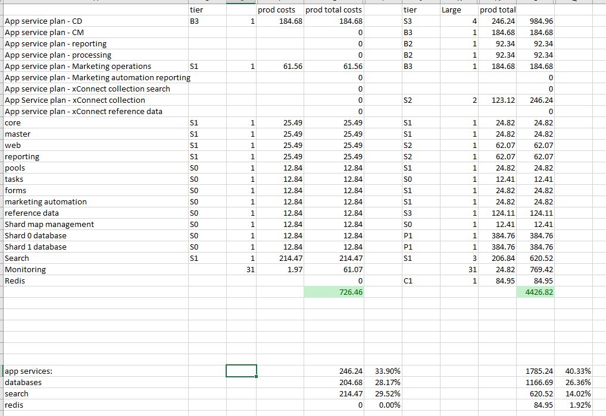
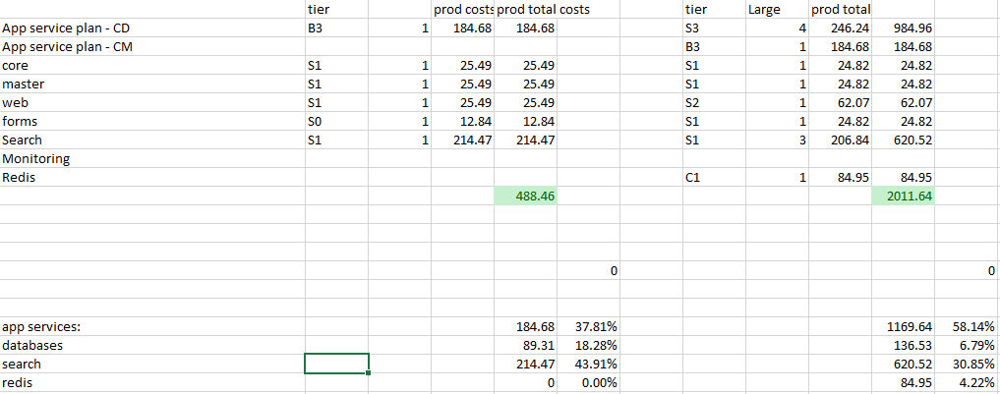

After working for quite a while with a lot of Sitecore workloads on Azure, we have built up quite some experience with regards to scale and costs management. Although Sitecore has some predefined [topologies](https://kb.sitecore.net/articles/043375), there may be various reasons why they will work or won’t work for you. From what we have seem, those topologies are not the most costs effective ones _and_ having different requirements might lead to different choices in terms of what tier is right for you. This series of blogposts gives an overview of choices that could be made and a small indication of the costs estimation for two of the Sitecore of Azure workloads (the Single and Large setup). Please note that some choices might only be valuable for XP or only for XM, or even not be beneficial at all, as there is not cookie-cutter solution for everything.

## An example

In the tiers that Sitecore defined, there is guidance to run the content management server on a B3 tier, which would cost you around EUR 112,05 a month. When the client has requirements on blue/green deployments for the CM and/or has a need for daily backups, the choice for the S3-tier could be made, as it supports out of the box staging slots and daily backups. While it costs EUR 40,- per month more, I am pretty confident that creating your own blue/green deployment strategy _and_ creating your own backup strategy will cost you far more than these EUR 40,- per month. In this case, the choice for a slightly more expensive setup could be made.  
  
In this blogpost some design considerations will be described that you could make to choose for a different setup as apposed to Sitecore’s guidance. This might be a choice from a developer’s perspective as well the choice from an infrastructural perspective. Please note that I only included _some_ considerations and all considerations that I have described, all benefit from a costs- and/or performance angle.  
  
Topics:

- App service considerations
- [SQL considerations](https://blog.baslijten.com/to-elastic-pool-or-not-to-elastic-pool-for-sitecore-on-azure)
    - [How to: Create a Azure SQL DTU consumption overview using Azure Metrics](http://how-to:-create-a-dtu-consumption-overview-using-azure-metrics)
- Azure Search considerations
- CDN considerations
- Redis considerations

Please note: in the end: running a website does cost money and running a large website costs more money. Increased load leads to increased CPU cycles, extra load on databases, azure search, redis and even application insights. While it is a common habit on premise to “just add a bit of memory, CPU and storage”, the most interesting part in Azure is “how can my design the most costs efficient without affecting the user experience”. This series of blogposts doesn't have the silver bullet on "what setup does fit for everyone", but I hope it will help with making the right choices, to have the most optimal Sitecore on Azure setup

## A rough estimation of the costs following the Sitecore recommendations

In the table below there is an rough costs estimation of Sitecore on Azure within the Western Europe region. Costs may differ over regions and may differ based on your agreements with Microsoft. For example: when having an enterprise agreement, you could run you non-production workloads in Dev/Test subscriptions, which greatly reduces costs for several pricing tiers in Azure App Service plans. It gives up to a 55% reduction on SQL and let’s you run a S2 app service workload for about 60% of the costs of a production subscription. In each blogpost I will make a reference on how to possibly reduce costs. The table below shows the estimated costs following the Sitecore recommendations.

estimated costs for the XP0 setup and a large scaled XP setup

estimated costs for the XM0 setup and a large scaled XM setup

The estimated costs for a development PaaS environment is roughly EUR 726,-, while a production instance might costs around 4426,82 per month. For the XM workload, this is a lot less; EUR 488,- for a development environment versus 2011,- for a large scaled XM production workload.  
  
The largest difference is in the database area; for the XP workload, there is a major cut on the budget due to the P1 workloads for the xConnect databases, while these databases get omitted by XM workload. It's a roughly 25% vs a 6% part of the costs, while there still is a large dependency on search services and app services.

The good news: costs for all environments can (greatly) be reduced based on smart choices!
