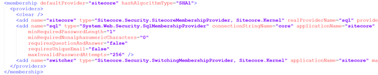
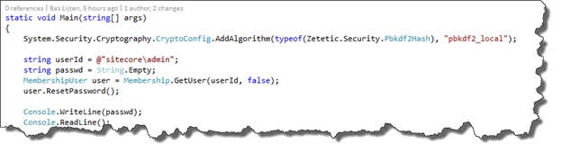

Let’s face it: It’s a business nowadays to hack sites, retrieve personal information and sell them on the black markets, think of usernames, passwords, credit card details and-so-on. Often, this data is stolen using SQL injection attacks, which _may_ be possible to your Sitecore site as well, thus, it’s better to be safe than sorry. As Sitecore ships with an old hashing algorithm to handle Sitecore users login, it’s time to replace the hashing algorithm as well. When having a fresh installation, this isn’t much of an issue, but for existing installations, you will face the challenge on upgrading your existing users, because the password hashing algorithm will be changed. This blogpost will show how to upgrade the hashing algorithm, describe those challenges, and tell you how to increase your Sitecore security.

Find the sources on [https://github.com/BasLijten/SitecoreDefaultMembershipProvider](https://github.com/BasLijten/SitecoreDefaultMembershipProvider) for use on your own Sitecore environment!

# The default Membership configuration

The default SQL Membership provider is configured out of the box as follows:

Sitecore is configured to use the provider “Sitecore”, which redirects to the “real provider” called “sql”, which is, in fact, the old membership provider from 2008.

When we look closely at the configuration, we notice a few things:

- Hashing algorithm SHA1 is used (which was standard back in those days)
- The default password policy is pretty weak

## The hashing algorithm

Hashing is a form of obfuscating a value that is irreversible, which makes it impossible to get the original value of this hash without brute forcing it, which basically means trying to hash every possible value until you get a value which is equal to the original hash. The longer the hashing function takes to execute, the safer it is to save passwords with this hash function.

## Changing the hashing algorithm

To use an alternative kind of all that is needed, is to replace the “hashAlgorithmType” to another, supported hashing algorithm. From a security perspective, there are few recommended algorithms, like for example “bcrypt” and “PBKDF2”, but they are not part of the Microsoft .Net framework. The SQLMembership provider that is being in use by Sitecore, only supports SHA1 and SHA256. Sitecore uses the SHA1 version, probably because of backwards compatibility issues.

### Option 1: Changing the membership providers

First,  the possibility to change the Sqlmembership provider into a newer one was explored; the DefaultMembershipProvider or the SimpleMembershipprovider. Although it’s not too much work to change this membership provider, this is not recommended

- The new membershipproviders require entity framework to run. This requires a change to the connectionstrings.config and the deployment of this framework, which might conflict which your current assemblies
- Those providers use new tables in the core database _and_ a migration of the old tables to the new tables. This may cause issues when upgrading to a new Sitecore version
- The DefaultMembershipProvider does not support bcrypt or PKBDF2
- The SimpleMembershipProvider uses PKBDF2 (with 1000 iterations), but it may be possible that this one does not fully work with Sitecore (didn’t test this out)

### Option 2: Adding new hashing algorithms to Sitecore

Another option was to deploy the new hashing algorithms to Sitecore. It turned out that this was the most secure _and_ easy way to increase the Security level.

The company “[Zetetic](https://www.zetetic.net/)” created the [.net versions of these algorithms](https://www.nuget.org/packages/Zetetic.Security) which can be used within your application. Before this algorithm can be used, these have to be registered first. I chose to do this in the initialization pipeline of Sitecore with just a single line of code:

This line of code will make the hashing algorithm available for use in the membership configuration section of Sitecore. Change the “SHA1” hashAlgorithmType to “pbkdf2\_local” and you’re good to go. Except for one small issue: due to the change of the algorithm, no one will be able to login anymore.

## Resetting the admin password

Step one would be to reset the administrator password. I create a small console app to do this, which can be found on github; it contains just a few lines of code:

If your installation is brand new, you are good to go, otherwise, the next step would be to reset the passwords for all other users as well. As the hashing values are irreversible, the only option would be to reset the passwords of all of your users, so that they would have choose a new one. Another option is to create a custom Membership provider to gradually change the passwords when users logon. [Kam Figy wrote a blogpost](http://kamsar.net/index.php/2013/09/upgrading-sitecores-password-security/) on this subject as well and has created [a prototype membershipprovider](https://gist.github.com/kamsar/6407742).

# Increasing the password policy

Another part is to increase the password policy, as the out of the box is pretty weak. [This page](https://msdn.microsoft.com/en-us/library/ms998347.aspx#paght000022%5Fsqlmembershipproviderconfig) describes the parameters that can be configured. I would recommend to set at least the following parameters:

- **maxInvalidPasswordAttempts:             5**
- **passwordAttemptWindow:             10**
- **minRequiredPasswordLength             12**
- **minRequiredNonAlphanumericCharacters 2**

 

A better approach would be to use the following regular expression (**passwordStrengthRegularExpression**) which forces the passwords to have at least an upper case, lower case, one number and a special sign in your password:

_/^(?=.\*\\d)(?=.\*\[a-z\])(?=.\*\[A-Z\])(?=.\[\\W\]).{8,}$/_

# Summary

Increasing the password security is not hard and I really suggest that you will do this right NOW! Although it might bring some inconvenience for your customers, you will really increase your security policy by a lot. If you don’t believe me? Watch this short youtube movie:

<iframe src="https://www.youtube.com/embed/lrGMxH8WNZ8" width="620" height="352" frameborder="0" allowfullscreen="allowfullscreen"></iframe>
