Clientside code is being used more and more on modern websites. Any kind of resources, for example Javascript, css, fonts, complete pages can be loaded dynamically into websites, from the current website or from an external domain. Attackers might be able to pull off an XSS attack by loading different kinds of data or scripts into your site which will run on your client’s browsers. These injections might happen on your own site, or in external services that you make use of (for example, disquss, or ads you are displaying). Applying a content security policy is one of the defenses against this kind of attack. This blogpost shows of scenarios that might happen (some of them tailored to Sitecore) and how the content security policy can help to prevent a successful attack from happening. As regular solutions provided on the internet do not supply the flexibility that a Sitecore solution (and CMS’ses in general) needs I decided to create a content manageable module and added that one to my SitecoreSecurity module.

This is _not_ a write-up on the complete CSP specification, there are other great sources for that on the web, I included them at the end of the article.

The module will be available on the marketplace when it has passed quality control. Sourcecode is available on: [https://github.com/BasLijten/SitecoreSecurity](https://github.com/BasLijten/SitecoreSecurity)

# The danger of XSS attacks – some scenarios

XSS attacks on itself can be quite harmful, but often the lead to even worse attacks. Imagine what could possibly happen when someone is able to inject custom JavaScript into your website. That attacker is able to run code on the clients machine, which could lead to several situations. The least harmful is showing an alert:

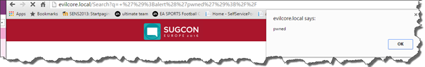

From a business perspective, this is a situation that you _don’t_ want to appear on your site. The complete site could even be defaced.

A more harmful situation is that a user might get control over your browser, without even noticing it. They would be able to load an external JavaScript and take over control of your browser. With the current HTML5 capabilities being able to use the camera, this could lead to a situation that the attacker can take videos or pictures remotely:

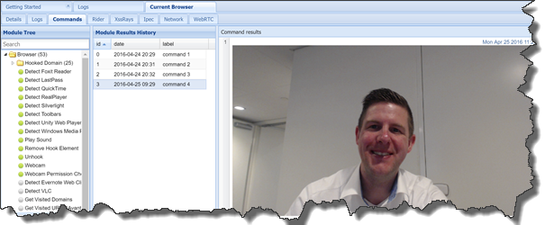

I even showed this off during my SUGCON presentation – Sitecore might be secure, but your site isn’t:

<blockquote class="twitter-tweet" data-lang="en">
Thanks for all positive reactions on my <a href="https://twitter.com/hashtag/sugcon?src=hash">#sugcon</a> <a href="https://twitter.com/hashtag/sitecore?src=hash">#sitecore</a> <a href="https://twitter.com/hashtag/security?src=hash">#security</a> session. As a reward, here the picture I took! <a href="https://t.co/l6FTJI4SHO">pic.twitter.com/l6FTJI4SHO</a>
— Bas Lijten (@BasLijten) <a href="https://twitter.com/BasLijten/status/724615041157312512">April 25, 2016</a></blockquote>

Worse things happen, when other parts of your security aren’t in place as well, for example, secure cookies ([when working over HTTPS and yes, you should _always_ do that](http://blog.baslijten.com/sitecore-security-2-secure-connections-and-how-to-force-the-browser-to-use-the-secure-connection/)), http-only cookies or session management. I showed off a scenario at the SUGCON where session fixation was possible, due to an XSS vulnerability in combination with bad session management. In this case, [Bobby Hack](https://twitter.com/BobbyHack_sc) (identity: extranet\\robbert) was able to view personal details of me, Bas Lijten:

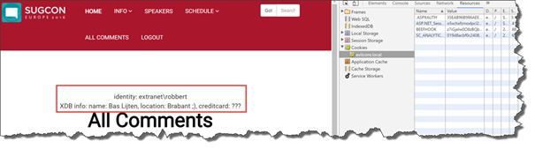

## What did these hacks have in common?

All hacks had one thing in common: the attacker was able to inject JavaScript into the page via a query string parameter that got interpreted _or_ to load a malicious external JavaScript file that got executed.

A very simple, yet effective way to prevent reflected XSS attacks, is to apply correct input and output validation. Don’t trust your external actors, never! But when that line of defense is broken, or some external service that you use has a broken security layer, other defensive mechanisms have to come in place. This is also known as “defense in depth”: never rely on a single line of defense.

# How can the content security policy help in here?

With the CSP, policies can be defined on what kind of resource is allowed, _how_ is it allowed and what sources are trusted? The resources are split amongst different categories, for example, default (your fallback/main policy), script, images, styling, et cetera. Per resource different options can be applied:

<table><tbody><tr><td width="160">None</td><td width="444">Prevents loading resources from any source</td></tr><tr><td width="160">All</td><td width="444">Allows all options</td></tr><tr><td width="160">Self</td><td width="444">Allows loading resources from ‘same-origin’</td></tr><tr><td width="160">Data</td><td width="444">Allows loading resources via de the data scheme (base 64 encoded images)</td></tr><tr><td width="160">Unsafe-Inline</td><td width="444">Allows the use of inline-elements; style, onclick, script tags, et cetera</td></tr><tr><td width="160">Unsafe-eval</td><td width="444">Alls unsafe dynamic code evaluation, such as the JavaScript eval() function</td></tr><tr><td width="160">Hosts</td><td width="444">The external hosts that are allowed to load content from</td></tr></tbody></table>

Not every parameter is available in each resource-group, it depends on the type of resources. Due to the categorization for each resource-type, flexible policies can be created to allow javascript to be loaded from \*.googleapis.com, disable inline-script and disable the unsafe-eval functions, while the css may only be loaded from the same-origin and Insafe-unline is allowed. A policy like that looks like:

Content-Security-Policy: default-src 'none' ; script-src 'self' 
https://\*.googleapis.com; style-src 'self' 'unsafe-inline' ;

_Please note that all major browsers support the content security policy header, some in the form of the normal header, some need the X-Content-Security-Policy headers. Some browsers do not support all resources as well._

## Creating a CSP

To create a CSP by hand can be very time-consuming. You’d need to know about the exact specifications (a script policy contains other parameters than a CSS policy, while the referrer section looks completely different). Is the option ‘none’ with or without quotes, is the option ‘self’ with or without quotes? How to specify the allowed hostnames? [Scott Helme](https://scotthelme.co.uk/), security specialist, created the website [report-uri.io](https://report-uri.io/), on which he hosts security tools and one of them is to create those CSP’s. Go play around with it and see how stuff works ;).

_For Sitecore, I created a module to do this, as multiple policies may need to be served and maintained per site. These CSP’s are manageable from content without too much effort, more on that later_

## Testing a CSP

When configuring a CSP, the policy can be created and be applied to the page. The next image contains the out of the box Sitecore landing page, with the following CSP applied.

_Content-Security-Policy:default-src 'none' ;script-src 'none' ;style-src 'none' ;
img-src 'none' ;font-src 'none' ;connect-src 'none' ;media-src 'none' ;object-src 'none' ;
child-src 'none' ;frame-ancestors 'none' ;form-action 'self' ;manifest-src 'none' ;_

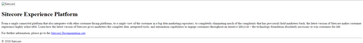

One of the lessons learned: Misconfiguring the CSP can seriously damage your site! The good thing is, that the Console exactly shows _what_ is going wrong:

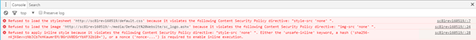

While this information can be used to test and modify existing policies, it’s not convenient to do this with a broken site. Luckily, there is a solution for this one: The Content-Security-Policy-Report-Only header. When the same policy is used with this header and the original CSP is _deleted_, the site will still work (unprotected!), while the new policy can be tested:

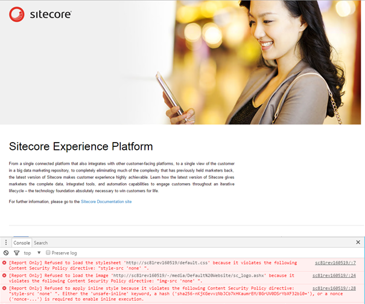

A mixture of a CSP and CSP-Report-Only will work together: Using this mixture, your site remains protected, while the modifications can be tested. Of course, different pages, with different policies will behave differently on different browsers (and how many times can the word ‘different’ be used in one sentence? I need to differentiate more ;)). [See Akshay’s blogpost on the browser differences for more info](http://www.akshaysura.com/2016/08/04/secure-sitecore-cross-site-scripting-xss-vulnerability-findings/)! This can be pretty hard to test and monitor in different circumstances. And of course, there is a solution to test and monitor these policies.

## Reporting CSP violations

To monitor violations (which can be malicious, or might be due to an error) is not too hard: the CSP specification contains a report-uri field which can be used to send to violations to. The website _[report-io](https://report-uri.io/)_, which I mentioned earlier, can also be used as endpoint to collect the CSP violations. I configured my site to report it to this service:

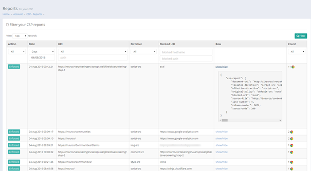

In this specific example, some enforced policies are shown (a filter on report-only didn’t work, as I didn’t have any report-only errors at the time). The first policy which is shown, shows a violation on the script-src resource policy: because of the use of the unsafe eval function, this violation happened. Another example is the 4th one, where an image violation has taken place. I configured my policy to only allow images from my own domain, while the site tried to load images from an external domain.

## Seeing a CSP in action!

In my example I referred to a XSS hack that I showed during the SUGCON. This hack involved loading a malicious, external JavaScript that was injected into a trusted subsystem. This Javascript was loaded on my page, which caused to remotely take a picture of me using my webcam:

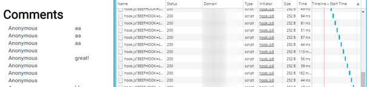

When the CSP is applied, this leads to the following behavior: the requests to the domain that is _not_ whitelisted get blocked by the CSP. This mitigation prevented a malicious user from taking a picture of me.

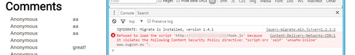

# Introducing Convenient Content Security Policy for Sitecore

While most blogposts on the internet learns us how to configure IIS to use CSP (by adding a header in the web.config), this doesn’t work too well for Sitecore. Each page might need another CSP (although I wouldn’t recommend that one) and how would a multi-site setup be configured? Would every CSP have to be created on an external site, copied over, verified, published, et cetera? While this would work for the first times, this wouldn’t work over time.

I created a template which contains _all_ of the CSP 1.0 and 2.0 options (yes my friends, next surprise, there are multiple versions ;). Using this template, separate policies can be created:

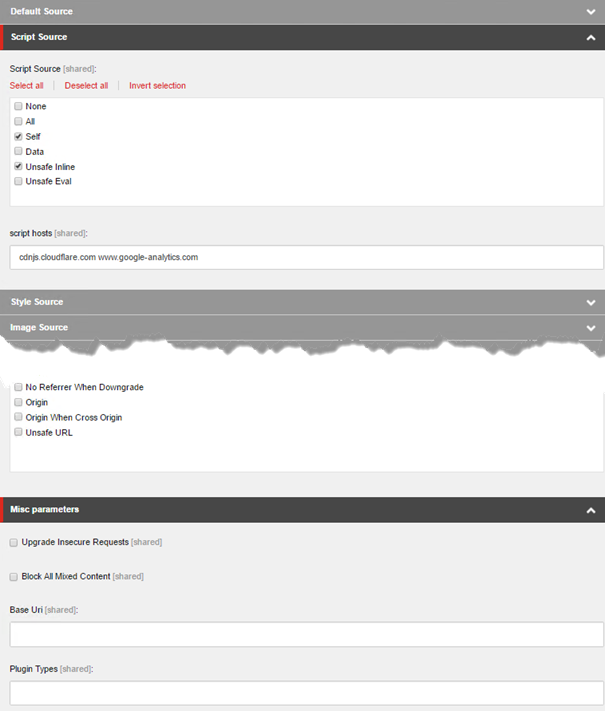

Another template, the Content Security Policy link, which contains the CSP Link and the CSP Report Only link, can be used as one of the base templates of a page ( I would prefer to have one single base content page template to which all the generic templates can be assigned). This results in the addition of two extra fields on your pages:

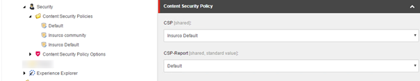

Using this mechanism, CSP’s can be reused easily, be put on standard values, be updated easily, et cetera! This results in the following extra response headers in your request.

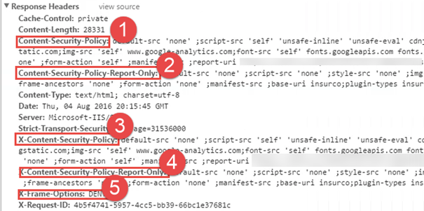

This module adds the X-Frame-Options header as well, based on the frame-ancestor setting for your CSP. It should lead to the same result, so it’s no use to configure this one separately and possibly differently. This would lead to strange browser behavior. Especially with the introduction of the X-Frame-Options header in Sitecore 8.1 update 3 – out of the box the X-Frame-Options: SAMEORIGIN header would be send in the response: this would conflict with this CSP policy.

# Summary

The Content Security Policy header is an excellent mechanism to defend against XSS and other code injection attacks. While the CSP itself can be quite big, confusing and even break your site, there are several tools and patterns to aid you in the journey to a safe website. With the introduction of the Sitecore Security module, the CSP’s can even be managed from within your content on a per-site or even per-page basis!
