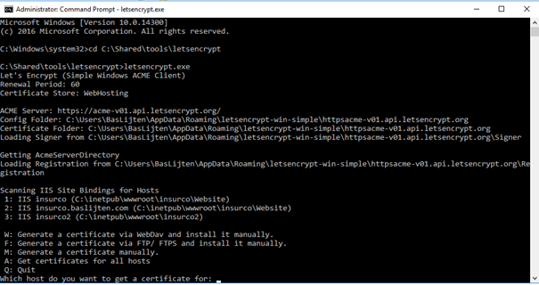
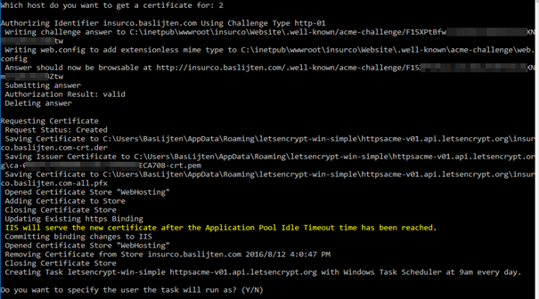
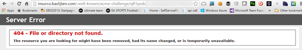
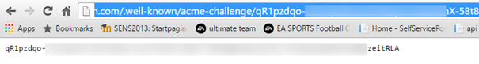
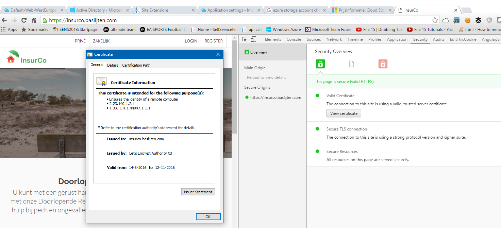

In a [previous blogpost](http://blog.baslijten.com/sitecore-security-2-secure-connections-and-how-to-force-the-browser-to-use-the-secure-connection/) about the Http Strict Transport Security I explained how to force connections to make use of https to encrypt connections. A lot of people think it’s expensive, hard to implement and slow. This blogpost shows off how you can get a free, secure certificate, get your Sitecore site up-and-running in no more than 5 minutes, just by using the [Let’s Encrypt](https://letsencrypt.org/) service. Source-code can be found [here](https://github.com/BasLijten/SitecoreSecurity) on Github.

# Why https and what’s needed for that

Basically, the only thing that you need to serve your site is a certificate which has to be updated once in a while. Of course, your site has to be built in such a way that it can be served fully over https, or you won’t make the most out of it. (for example, no mixed content).

The reasons to switch over to HTTPS are numerous:

- it’s safe – with a man in the middle attack, your data can’t be sniffed, manipulated or redirected
- [it’s faster](https://www.cloudflare.com/http2/) – when used over http/2. Windows server 2012 doesn’t support this, but Windows server 2016 In my next blogpost I’ll show off some results
- It’s better for SEO – When a page is served over https, google increases the page-rank for that page

## But why are there so many sites _not_ using https?

**Costs** - On a lot of different places, those certificates are offered for $10 to $200 dollars per year.

**Extra work** - Those certificates are send over mail (boohoo), should be downloaded manually or any other manual interaction is required to obtain and install these certificates. I promise you: This \*will\* be forgotten. One, two, ten certificates will be mangeable, but when you’re about to administer more-and-more certificates, things will be forgotten. Eventually, this will cause your site to break, as your certificates are out-of-date

**Hard –** Where should I store them? How can I import them to IIS? Who should do that?

# Meet Lets Encrypt

Lets encrypt is an online service which has the mission to serve the complete web over https. To achieve this, using https has to be as easy as possible, that’s why they are using the [following principles](https://letsencrypt.org/about/):

- **Free:**Anyone who owns a domain name can use Let’s Encrypt to obtain a trusted certificate at zero cost.
- **Automatic:**Software running on a web server can interact with Let’s Encrypt to painlessly obtain a certificate, securely configure it for use, and automatically take care of renewal.
- **Secure:**Let’s Encrypt will serve as a platform for advancing TLS security best practices, both on the CA side and by helping site operators properly secure their servers.
- **Transparent:**All certificates issued or revoked will be publicly recorded and available for anyone to inspect.
- **Open:**The automatic issuance and renewal protocol will be published as an open standard that others can adopt.
- **Cooperative:**Much like the underlying Internet protocols themselves, Let’s Encrypt is a joint effort to benefit the community, beyond the control of any one organization.

# How does this work?

There are a lot of tools to get Let’s Encrypt to work with windows and IIS. [Troy Hunt](http://www.troyhunt.com/) wrote a _great_ blogpost on [how to set Let’s Encrypt up with Azure web apps](https://www.troyhunt.com/everything-you-need-to-know-about-loading-a-free-lets-encrypt-certificate-into-an-azure-website/). The short story on [how Let’s encrypt works](https://letsencrypt.org/how-it-works/) is:

- **Validate the domain** - if the website is accessible via the domain that you want to create certificates for it must be your domain.
- **Let’s Encrypt creates a token -** that needs to be accessible via your website on that same domain
- **Place that token on your website –** Let’s Encrypt must validate that token. If it’s accessible, the certificate can be created
- **Store and bind the certificate –** Store the certificate in the certificate store, bind it to your domain in IIS and you’re ready to go!

One of the tools that’s available to get let’s encrypt to work with IIS is [Let’s encrypt win simple](https://github.com/Lone-Coder/letsencrypt-win-simple). It offers an executable which lets you select a host to create a certificate for, install it to IIS and automate that process which is included above.

After the selection of the correct host, the tool tries to validate your domain and tokens:

Because of the protocol, the token is expected to be available via <yourdomain>/.well-known/acme-challenge/xxxxxxxxxxxxxxxxxxxxxx.

# Get it to work with Sitecore

Out of the box, this doesn’t work with Sitecore, as the Sitecore (well, MVC) prevents the item from being rendered.

Using a simple web.config in this directory, fixes the issue. In my Security module on github, I included this web.config which automatically get’s deployed. It work’s multi-site, so it’s accessible via any site that you configure, no extra work is needed!

After validation by the let's encrypt tooling and positive feedback, the certificate is automatically imported, put into the right store and bound to your IIS application. This results in a website that's being served over https:

# Summary

Securing your website has become much more accessible since the introduction of let’s encrypt and their automation tools! Using the my Sitecore Security module on github, the use of let’s encrypt is accessible as for any other .net application.
