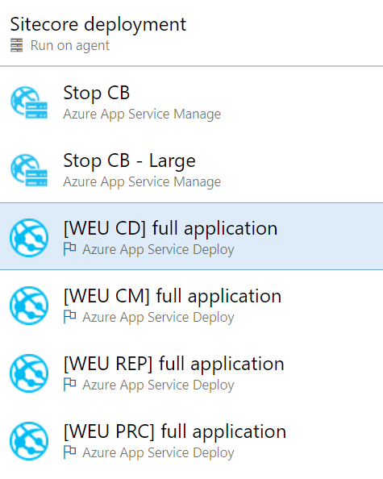
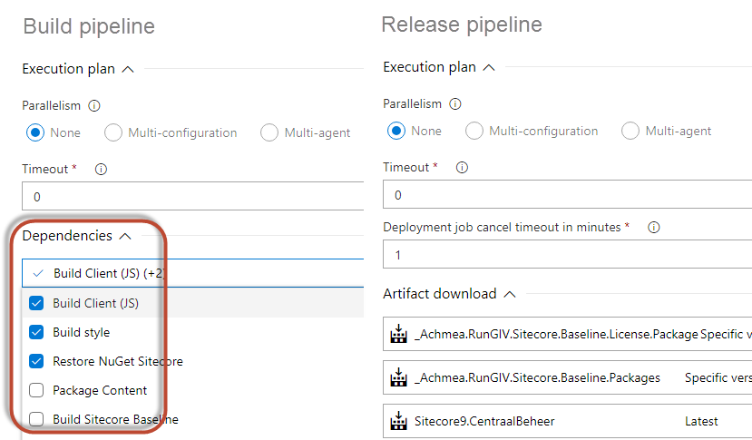
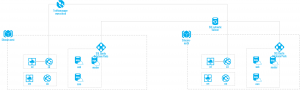
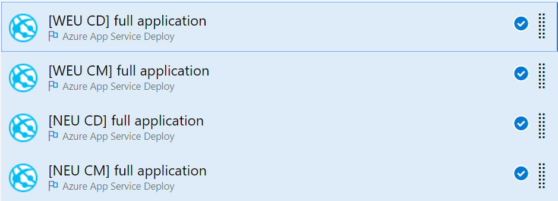
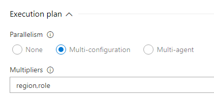
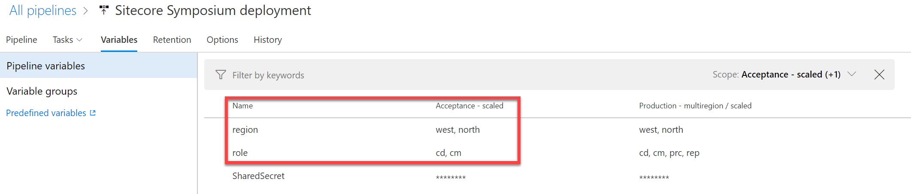
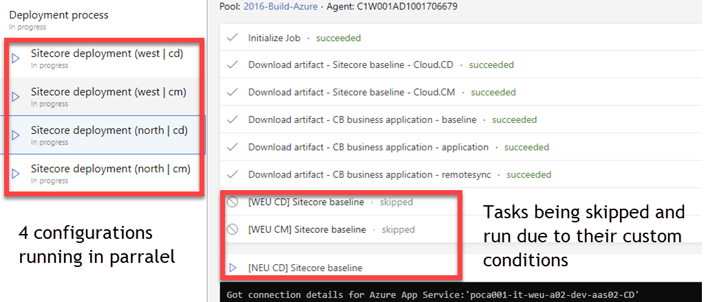

_Note: Although this blogpost series is focused towards deploying Sitecore with the speed of light, all the information in this blogpost regular web applications and app service deployments_

Deploying multiple web deployment packages to multiple app services may take some time. Where parallel jobs in the Build are possible, this is not possbile (yet) in Azure. ARM templates could be used (but I am not 100% sure), but we chose to use app service deployments, as it gives us much more flexibility.

This blogpost is part 9 of the series “Automate your pipeline”. The blogposts may or may not be released in the order as posted in the list below,

- [part 1: Automate your pipeline part 1: World’s fastest delivery pipeline for Sitecore on Azure](http://blog.baslijten.com/automate-your-pipeline-part-1-worlds-fastest-delivery-pipeline-for-sitecore-on-azure/)
- part 2: Provisioning vs deployment
- part 3: different types of modules
- part 4: automate msdeploy all the things!
- part 5: create your own packages using msdeploy – the Sitecore baseline
- part 6: Patch the unpatchable – how to handle changes to the web.config
- part 7: how to build your business application
- part 8: how to deploy your business application
- **part 9: speed up your deployments – parallel app service deployments in Azure** **DevOps using the app Service deploy task**(this blogpost)
- part 10: speed up your deployments – unicorn
- part 11: speed up your deployments – does size matter?
- part 12: deploy with the speed of light
- part 13: release toggles (release toggles)

# Deployments to the Azure App Service using msdeploy

MSDeploy is used to deploy web deployment packages to azure app services. ARM uses this tool under the hood to deploy the defined web deploy packages, the Azure App Service deploy task can use msdeploy and, of course, PowerShell could be used. We chose to use the Azure App Service task, as the ARM templates don't give too much flexibility from a msdeploy perspective; several actions that can be configured using the msdeploy command or Azure App Service task are not implemented in ARM, for example the -skip: options. When your package(s) require new parameters, the ARM templates have to be changed as well. We try to keep our ARM templates generic; this way, the can be reused amongst different projects, that's why we don't prefer to change those ARM templates into application specific templates. As the Azure App Service deploy task does a lot of the heavy lifting, such as setting up the connection, getting credentials, we prefer to use the App Service task instead of creating an own powershell task and maintain that one.

## Release jobs

Within a release pipeline different jobs can be defined. With a job a set of tasks are configured, which are run sequentially. In our situation, we have to deploy multiple app services to multiple regions _at once._ All these app services are part of a CMS platform called "Sitecore" and they all fullfill different roles; the "CD" role serves the role of "Content Delivery"  to the visitor, the "CM" role serves the role where content can be managed.

## Parallel deployments using agent jobs are not possible in the release pipeline

At the moment of writing, 18/10/2018, parallel jobs are _not_ _yet_ possible in the Azure DevOps deployment pipeline. With other words, it's not possible to define a job which deploys an app service in region "Northern Europe", define another job which deploys to an app service in region "Western Europe" _and_ to run these jobs simultaneously. However, this _is_ possible in the Azure DevOps build pipeline: By selecting the correct dependencies, Azure DevOps decides which jobs can run in parallel and which not, but, this option is not yet available within the release pipelines:

## How to configure parallel deployments of Azure App Service

Although parallel jobs are not possible, it _is_ possible to run tasks in parallel, but it requires a bit of configuration, which will be explained in this section.

In the image below a simplified Sitecore setup is displayed, where all services need to be depoyed at once. (For zero downtime we are using staging slots, often referred to as "blue-green deployments")

\[caption id="attachment\_21264" align="alignnone" width="778"\] simplified sitecore diagram\[/caption\]

The first step is to define each task in the pipeline. Take note of the naming convention: We chose to name what role will be deployed to what specific region. This will help identifying what's happening in a later stage.

Each task has a unique operation to:

- deploy CD _role_ to the West Europe _region_
- deploy CM _role_ to the West Europe _region_
- deploy CD _role_ to the north Europe _region_
- deploy CD _role_ to the North Europe _region_

The second step, is to define the unique actions. In my case, I have the apps with role "CM, CD" and regions "West, North", which could be _configuration parameters._ these tasks could (and should) be run in parallel.

The trick lies within configuring "Multi-configuration" with the "Execution plan" section and setting the parameters as multipliers. This can be configured on the job itself.

\[caption id="attachment\_21194" align="alignnone" width="421"\] Execution plan in Azure DevOps\[/caption\]

To get this multiplier to work, two variables, called "role" and "region" should be added. Please mention that by adding regions or roles, extra combinations of these configurations will be added (this is the case in the production setup):

\[caption id="attachment\_21294" align="alignnone" width="2123"\] Variables in Azure DevOps release pipeline\[/caption\]

When this releases is queued, _every_ task would be executed, for every configuration, which means that every app service would have been deployed 4 times _and_ sequentually, which means, things will go wrong _and_ will take longer. T

The trick resides into configuring a "custom condtion". This is available within the Control options section. change the "Run this task" option from "Only when all previous tasks have succeeded" to "Custom Conditions". An option appears to specify a state when this task should be run. "Only when configuration parameters equal to the specified role _and_ region". In every other situation, the task will be skipped.

the custom condition that should be set is the following, where the 'west' and 'CD' value change for every task. The complete syntax can be found [here](https://docs.microsoft.com/en-us/azure/devops/pipelines/process/conditions?view=vsts&tabs=yaml).

and(eq(variables\['region'\],'west'), eq(variables\['role'\],'CD'))

\[caption id="attachment\_21214" align="alignnone" width="420"\] Custom Condtion in Azure DevOps\[/caption\]

Save the release and queue it. When running this release, Azure DevOps will add a few extra tabs in which every configuration is displayed. Within this tab, every task is shown. While each configuration is running in parallel, the tasks that should not run within that job are skipped as well:

\[caption id="attachment\_21314" align="alignnone" width="1026"\] Azure DevOps parallel tasks\[/caption\]

 

# Summary

Although the convenient way of running jobs in parallel is not yet availalbe for the release pipelines in Azure DevOps, it _is_ possible to get this to work. In case of the sitecore platform, where sometimes more than 18 apps have to be deployed in parallel, this can save a _lot_ of time and will dramatically increase the speed of your acceptance and production deployments
