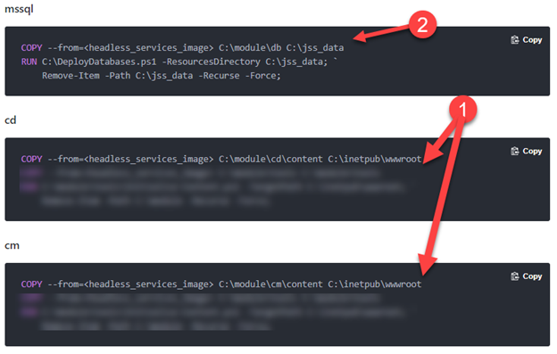
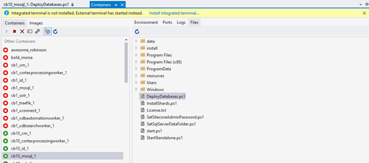
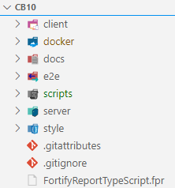
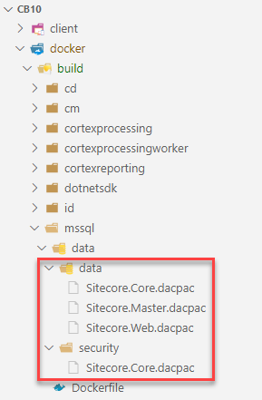
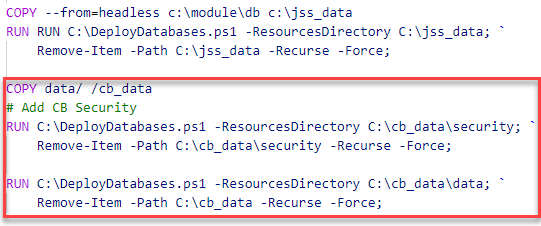
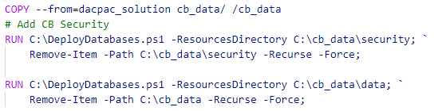
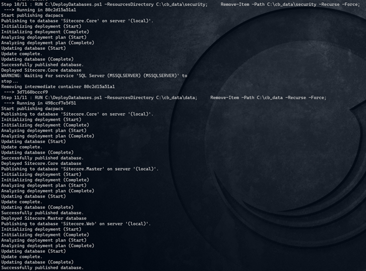
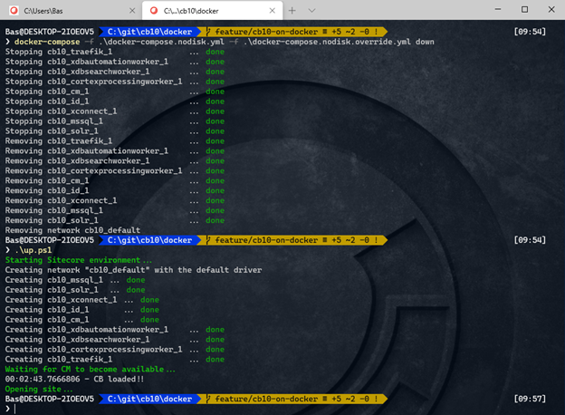

In our company, we use Unicorn for content serialization, in order to be able to deploy “applicative” content like templates across our environments. For dev and test, we also provide content that we use for regression testing in these environments; we don’t (want to) sync our production content to these environments. We also had the wish to spin up environments upon request, with all of this content available in an instant, for example to validate pull requests. With 20000 yml files, the synchronization process takes at least 45 minutes: this takes way too long for a fast regression test and doesn’t fit in a fast “shift left” strategy. With the introduction of containers, things have changed, as full pre-provisioned environments can be spinned up in literally minutes.

https://youtu.be/IGLShxQa1Eo

_Note 1: My current opinion is that this is not a feasible way to deploy content into production!_  
_Note 2: I recently found out that this is the same approach as the demo team uses to provide their Lightroom demo_

# Summary

To increase the speed of spinning up a new environment _with_ content, the Sitecore database image needs to be preprovisioned with all custom content that is available. These are the steps to achieve this result:

1. Create a new dacpac of your serialization folders using Sitecore Courier
2. Update your mssql dockerfile to deploy this database
3. Push your image
4. Pull the image and run your environment using docker-compose on any place

I omitted several steps in this blogpost, as this information can be found on a lot of places on the world wide web: pushing images is a one-liner and pulling images shouldn't be to hard as well ;)

# Provisioning a new environment with content within 3 minutes – how does it work

I got the inspiration from how Sitecore is proving their modules to the community: they provide a very basic Sitecore environment, which _only_ contains the XM/XP content and roles. As a “a la carte” menu, they offer different Sitecore modules which can be included in your docker container. For example, when there is a requirement for the headless services (THSPKAJ – The Headless Service Previously Known As JSS) , this Sitecore image can be used as an artifact and by copying the binaries/assets from these images into your CM and CD dockerfiles _and_ applying the database asset to your sql image, the headless service magically becomes available. Using this approach and starting a “vanilla” Sitecore environment with JSS, is done within moments.

### Provisioning environments the old way: a new environment with unicorn content serialization takes a long time

This “a la carte” way of working was already something that we incorporate in our solutions: with 150 sitecore instances, a manual installation of modules/update packages is very time consuming, repetitive and error-prone. That’s the reason that we created nuget packages for every module – Sitecore PowerShell extensions, JSS, Coveo and a lot of internal modules. The required content is provided as yml, using unicorn. By just referencing the nuget packages, we were able to incorporate these modules into our solutions. Our Sitecore environment blueprint and custom applications are build as web deploy packages, hence deploying one or two webdeployment packages, is all it takes to provision a environment. The drawback of this approach, is that new, temporary environments take almost an hour to provision, as the unicorn sync _really_ takes a long time. Transparent sync could be used of course, but this isn’t always an option. Apart from that: using containers, our local testers don’t require a local setup of visual studio, sql, Sitecore, iis and whatsoever: with other words, developers need less time to support these testers!

## A detailed look into the sitecore’s approach with pre-provisioned content _and_ the missing link

By taking a look at the docker build-files for the CM, CD and MSSQL environments, the approach by Sitecore can be seen.

Within the actions marked by “1”, a simple copy action takes place, from the Sitecore “asset” image to the wwwroot. This is just a set of binaries and assets, just like the composition of your custom solution.

It gets interesting at action 2: at first, a _certain_ asset is copied. The second command deploys a database from the directory to which the database just got copied (and gets removed afterwards).

It’s very likely that in this action, the specific JSS-_databasecontent_ was provisioned to some existing databases. But _which_ databases and _how?_



## Uncovering the magic behind the DeployDatabases1.ps1

The DeployDatabases.ps1 is a tool which resides in the mssql database image provided by Sitecore. However, I wasn’t able to find the sources behind this file. However, using vs code or visual studio, it is possible to attach to a running container and see the complete filesystem behind it:



This uncovered the secrets behind the DeployDatabases.ps1 (more secrets are revealed in a follow up blogpost!). The most interesting part can be found here:


The script iterates through all \*.dacpac files in the specified _Resources_ directory, the one that is specified as resourcesDirectory in the RUN command in your Dockerfile.

Foreach dacpac, the fullname (sourceFile) and the basename is extracted (lines 100-103). The interesting part happens at line 116: using the sqlPackage command, the sourceFile is applied on the database which contains the name of your dacpac file. What does this mean? Let’s say you have the a dacpac located in “c:\\jss\_data\\Sitecore.Master.dacpac”, then this file will be applied to an already existing “Sitecore.Master” database.

_Of course, this technique of using dacpac is not new, as it has been used for ages by Sitecore in their Web Deployment Packages (for use in conjunction with, for example, azure), but there is one difference:In the “Azure” or “On premise” scenario, the perquisite is that there is already a running infrastructure: at least a webserver needs to be configured and Sql needs to be setup as well. When you would spin up a new, fresh environment, this would require to setup a new fresh webserver and a fresh new set of databases, which do cost (a lot) of time. In this case with containers, the actual data gets embedded into the docker image, the only thing that is required, is that the image is pulled and you’re good to go._

## Package serialized content into a Dacpac file.

This is where things became more complicated. My first approach was to generate an update package using Sitecore Courier and to use the Sitecore Azure Toolkit to generate a web deployment package from that update package. The dacpacs could then be extracted from the WDP. This approach could take quite some time, is complex (as in: it takes a lot of steps) and I had no idea if this approach would even work!

Purely due to some luck, I discovered that the Sitecore Courier PowerShell commandlet includes a parameter to generate a dacpac directly!


A day later, I discovered that the Sitecore demo team uses this approach as well. They use the following script, which can be found [here](https://github.com/Sitecore/Sitecore.Demo.Platform/blob/main/scripts/Packaging/generate-update-package.ps1) in their repository. The only modification that I made, was by adding line 21: to copy the Sitecore.master.dacpac to Sitecore.Web.dacpac. As the deploy databases script tries to deploy any dacpac, based on the naming convention Sitecore.<sitecoredatabasename.dacpac, the web dacpac would be automatically applied to the web database.

```
Param(
  [string]$target,
  [string]$output
)

Write-Host "Installing Module"
Install-Module -Name Sitecore.Courier -Repository PSGallery -Force -Confirm:$False  -RequiredVersion 1.4.3

Write-Host "Importing Module"
Import-Module Sitecore.Courier -Force -Verbose

Write-Host "Creating Update Packages"
New-CourierPackage -Target $target -Output "$output/data" -SerializationProvider "Rainbow" -IncludeFiles $false -EnsureRevision $true -DacPac $true
Write-Host "Created Update Package" -ForegroundColor Green

New-Item -ItemType Directory -Path "$output/security"
New-CourierSecurityPackage -items $target -output "$output/security/Sitecore.Core.dacpac"
Write-Host "Created Security Update Package" -ForegroundColor Green

Rename-Item  -Verbose -Path "$output/data/master.dacpac" -NewName "Sitecore.Master.dacpac"
Copy-Item -Verbose -Path "$output/data/Sitecore.Master.dacpac" -Destination "$output/data/Sitecore.Web.dacpac"

Rename-Item  -Verbose -Path "$output/ data/core.dacpac" -NewName "Sitecore.Core.dacpac"

Write-Host "Renaming dacpacs" -ForegroundColor Green
```

## Building the SQL image

The large project that was used as crash test dummy, has the following structure:



The server folder contains all the Sitecore code _and_ serialized content, the docker-folder contains the dockerfiles for every role. Hence, the “./server” folder was used as target and “./docker/build/mssql/data/” as output folder.  

This resulted in the following output:



All that is left to do, is to modify the docker build file to deploy these databases (as discussed in one of the previous paragraphs). After the deployment of JSS, the custom content will be deployed to the database. This has been done in two steps:

1. The Security package will be deployed
2. The “regular” content will be deployed.

Where the JSS module is copied from the headless image, which was provided and pulled from Sitecore, the custom content is, _in this case,_ copied from the data directory in the build folder.



It _is_ possible to incorporate the generation of the dacpac in your solution image (or in any other). When planning to go this route, please take note that this action _might_ be very time consuming, in our specific case this takes 5 minutes of extra build time. As this step is _not_ required for your production workload, I’d recommend to create a separate builder image to create these dacpacs, as it won’t “pollute” your solution image. _I'll will go in depth in structuring your dockerfiles for CI-speed in a later blogpost!_

In case of using an image to pull your generated dacpac from another image, the copy action in the mssql- dockerfile would copy the data from the solution-image:



# Building the new SQL image

All is left to do, is to build the new SQL image:

```
Docker-compose build msqql
```



After several minutes, the new image is ready for use: by explicitly bringing all roles down and recreating those roles, this environment gets started from scratch, within 3 minutes. Publishing content is not needed, as the web database was already pre-provisioned as well. The official publishing mechanism hasn’t been used, but this is, for regression testing an acceptable approach!

_To test this approach, the docker-compose.yml and docker-compose.override.yml were modified in such a way, that all volumes were removed!_



# Conclusion

When having the need of starting an environment with pre-provisioned content within minutes, for example for demo’s, regression testing or automated testing, the old friend Sitecore courier is of (very) much help. The changes that are required are not complex, there aren’t many changes, thus this approach was a very easy approach to test. Of course, Unicorn Transparent sync could be used as well, but I didn’t use that approach yet. I would NOT recommend to use this approach in production, as you wouldn’t be able to edit and store content. Do not include the generation of dacpac’s in your solution file as well, as it increases the build time for non-required assets to run on production.
