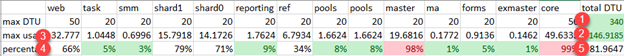
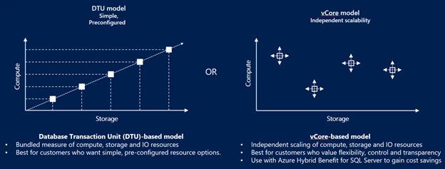
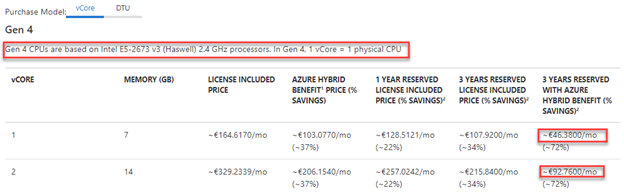
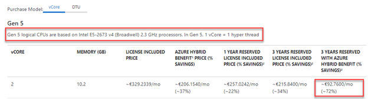

In the Sitecore #azure [slack channel](https://sitecorechat.slack.com) there are often discussions about pricing, scaling and performance. A common best practice which is shared in this channel is the use of Elastic Pools for your SQL databases. In this article I our findings, how you can compute the costs for elastic pools and how it will affect performance, as opposed to the default Sitecore ARM templates.  
  
PS: the costs I share are all retrieved from the [Azure pricing calculator](https://azure.microsoft.com/en-us/pricing/calculator/?devtest=true&service=sql-database) and are not actual prices from my company – I will _never_ share these.  
  
This blogpost is a part of [these blogpost series](https://blog.baslijten.com/sitecore-on-azure-design-considerations-to-be-more-cost-efficient-and-have-more-performance/)

## Total costs of Sitecore databases on Azure Paas

The exact amount of costs depends on the way how the Sitecore environment has been scaled. In [_default Sitecore tiers_](https://kb.sitecore.net/articles/043375) different combinations of isolated SQL databases have been used, which result in the following Pay-as-you-go costs. At the moment that there will be a requirement on “automatic failover, geo replication” or whatsoever, the default setup does not meet these requirements and will effectively lead to a double in SQL costs, which wouldn’t be a major problem for the XM setup, but will lead to a significantly increase of costs for the XP setup.  
  
Below are the costs for the XP/XM single and large workloads, following the [Sitecore recommendations](https://kb.sitecore.net/articles/043375)

<table class="wp-block-table"><tbody><tr><td>tier</td><td>Single XP</td><td>Large tier XP</td><td>Single XM</td><td>Large tier XM</td></tr><tr><td>Costs</td><td>198,56</td><td>1167,-</td><td>86,-</td><td>136,53</td></tr></tbody></table>

## Changing from isolated databases to an elastic pool

While Sitecore’s default setup offers isolated databases, a lot of people move over to the elastic pool model. It is often seen that the core, master or web databases consume 100% of all the computation power (especially under load, after deploying or after publishing), which has a negative performance and uptime impact on the complete environment. The elastic pool offers the possibility of reserving DTUs, which will be divided runtime between all databases. And while a master/core database will require more performance after a deployment, a web database will need more performance when under heavy load. In the isolated setup, the DTU’s that are not consumed by all of the databases cannot be used by the database that requires it at that very moment, which _is_ possible with the elastic pool model.

### An analysis of a workload running in production

In this overview I’ll show a roll up of the DTU consumption of databases during the last week of last year and first week of this year on an environment that had quite some load. Please not that we didn’t use forms and that we didn’t enable the analytics on the Content Delivery servers, so this might give a distorted view in comparison with_your_ environment, but it helped _us_ to scale our environment delivery to save a serious amount of money:

rollup of database resource consumption for a production workload - Learn how to create your own overview here  

Legend:

1. The total amount of committed DTU
2. The sum of the maximum use of DTU of each database at any given time in these two weeks
3. The max DTU usage of the database in these two weeks
4. Maximum percentage of assigned DTU that was consumed in these two weeks
5. The maximum hourly total DTU consumption

This simple overview gives a lot of valuable insights:

- If every database was running max effort simultaneously, that we would have consumed just 43% of the reserved capacity – which is a waste of money
- In this actual view, we were just consuming 82 DTU at most during these two weeks: just 24% of all resources have been consumed. This is even a larger waste of money
- Some databases didn’t do anything: marketing automation, forms, exm, smm, tasks – a waste of money. The DTUs were committed but couldn't be used by other databases
- The master and core databases didn’t cut it at certain times. This happened after deployments and after publishing. It would have been great if the tasks, forms and marketing automation resources could have been used during those times

### A solution: Move databases to the elastic pool

While there was an overcommitment, some databases still didn’t cut it. Using an elastic pool is an excellent solution for these problems. As we were just consuming 82 DTU at max, the move to a 100DTU elastic pool is quite interesting: while the total costs for a single instance isolated database setup are EUR 199,-, the large production workload costed us around EUR 430,- (we didn’t scale shard0 and shard1 to P1, as we didn’t use the xconnect services too much yet).  
  
By moving to a 100 DTU elastic pool, the costs could have been reduced to 186,-, according to the azure pricing calculator.

### The downside of a single elastic pool

What every advantage, a disadvantage shows up. With every database in a single pool, a situation could occur where the xconnect databases and the web databases are fighting for resources. As the resources are not isolated anymore, this could lead to decreased performance. It might be an option to assign different sets of databases to different pools, for example.

- Web database (isolated database)
- All other Sitecore databases (core, master, forms) in a single pool
- All xConnect related databases in a different pool

## Changing the purchase model from DTU to vCore

When diving into the [Azure SQL pricing options](https://azure.microsoft.com/en-us/pricing/details/sql-database/single/), it becomes clear that a price reduction on this setup is not possible, however, a change to use the vCore model, instead of a DTU model, opens up the possibility to make use of the Azure hybrid benefit (bring your own on premise sql license) and the use of reserved resources; resources could be reserved for the next 3 years. A combination of both options could save up to 79% of costs! (more on that later)

### Differences between DTU and vCore

The DTU-based model basically is a linear combination between computing power and storage, whereas the vCore model delivers a much more flexible way of assigning compute-resources:

DTU model vs the vCore model

The general rule of thumb: Each 100 DTU in the standard tier requires at least 1 vCore in the general purpose tier. More info on these model can be found [here](https://docs.microsoft.com/nl-nl/azure/sql-database/sql-database-purchase-models#understanding-dtus).  
  
When applying this model on the information that we just have analysed, a choice could be made for a 1vCore general purpose setup. When bringing own licenses _and_ reserving resources for the next three years, it could bring the price down to just 46,- in a Gen 4 setup or 92,- for 2 vCores in a Gen 5 setup. Looking back at the estimated costs, that is a reduction for every workload!

Gen 4 vCore pricing options

Gen 5 vCore pricing options

In the end the costs for the production workload have been reduced from the initial 430,- (in our case) to almost a tenth of this amount; 46,-.

# Summary

The Sitecore default recommendations leave room for performance and costs effective choices. In our case, creating a simple overview of the committed DTU’s and the actual usage lead to a enormous decrease in costs, while having better performance. Every situation is of course different. This setup works for us, but might not work for you. The numbers tell the tales: measure, gain insights, get your conclusions and see what optimizations from a performance and a resource consumption view could be applied in your case. Make sure to gain insights in what databases are (over)commited, what databases are undercommited, what databases could share an elastic pool and create a new design for that situation.
