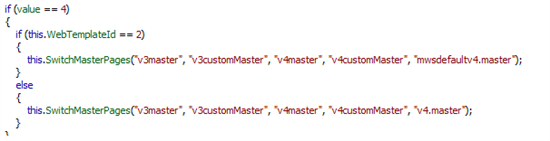
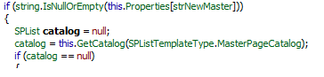
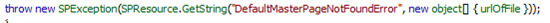
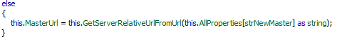
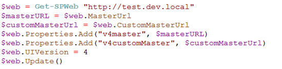

When upgrading from SharePoint 2007 to SharePoint 2010, several scenarios are possible. When using [the database attach method](http://technet.microsoft.com/en-us/library/cc263299.aspx "database attach method"), it's possible to stay in "V3" mode, or execute a visual upgrade too and make use of all SharePoint 2010 love. Whenever custom masterpages have been created for SharePoint 2007, the visual upgrade itself isn't too much of an option: it upgrades the UIVersion of the current web to V4, but the custom masterpage is replaced by the default v4.master, which (of course) doesn't provide any customizations. the next step is to create a new customized masterpage for SharePoint 2010, add it to your site and make sure to set this masterpage as the new default/custom masterpage.

The scenario I wanted to achieve, was the following:

1. Deploy my custom solutions with all masterpages already upgraded to SP2010, so only the UIVersion should be upgraded
2. Attach the content database
3. Upgrade the site to v4 mode, without the need of a v4.master deployment

## The problems of (visual) upgrading to SharePoint 2010

The problems of visual upgrading consist of several issues: it doesn't work right out of the box (but that is expected), and some steps are needed to deploy and undeploy a masterpage, before the real SP2010 masterpage can be set, because the v4.master seems to be _**required**_

### 1 - Upgrade the site doesn't work immediately

As stated above, a visual upgrade using the user interface or upgrade by code/powershell is needed to let the existing site run in v4 mode:

1: $web = Get-SPWeb [http://site](http://site/)
2: $web.UIVersion = 4
3: $web.Update()

sadly, this will bug out, because SharePoint _requires_ the v4.master to be able to upgrade to v4-mode. The v4.master has to be made available via a feature (or manually) in the masterpage gallery, before the upgrade can be executed.

### 2 - Upgrade to a masterpage that isn't needed

Assuming that all customizations that did exist in SharePoint 2007 need to be retained, the above solution isn't the final solution. Next steps are to create a SharePoint 2010 masterpage with the customizations, deploy that masterpage, and set that masterpage as the default/custom masterpage for that site. And because that v4.master wasn't needed at all, that feature should be deactivated, or even better for hygienic reasons, be uninstalled and deleted.

### why is this a problem?

As this isn't to much of a hassle for a few sites, it does whenever some big portals/intranets are migrated, with a lot of different masterpages. When working with about 10.000 webs, this needs to be automated, but activating anddeactivating 10000 times a feature can be quite time consuming. A lot of time can be saved, whenever the customized masterpages are already "SP2010-ready", so all is left to do, is to set the UIVersion to 4.

## The solution of quickly applying a visual upgrade without a v4.master

As described above. I wanted to achieve the following scenario:

1. Deploy my custom solutions with all masterpages already upgraded to SP2010, so only the UIVersion should be upgraded
2. Attach the content database
3. Upgrade the site.

### what happens behind the scenes?

When firing up reflector, we see that the following happens in code:

When the UIVersion is set, an internal function called "SetUIVersion" is executed. This function takes the UIVersion as a parameter and a boolean which decides wether or not to set the masterpage. _Unfortunately, this function is an internal function, so it can't be used without using reflection._

The SetUIVersion function contains some logic to determine whether to rollback to UIVersion 3, or to upgrade to UIVersion 4. After the decision, the internal function SwitchMasterPages is called, with 5 parameters:

That function is called with the following parameters

And what happens _in_ this function gets interesting. This function checks what default and custom masterpage are currently set (the V3 masterpages), and stores them in the propertybag of the current web, specified, by the parameters specified in the function. To determine what new masterpage needs to be set, that same propertybag is checked: in this case the properties "v4master" and "v4customMaster". if they are empty, the default v4.master is used:

_and in this part of the function, the error is thrown that the default masterpage couldn't be found:_

When the propertybag isn't empty, the value of that propertybag is set as masterpage:

And that is our solution!

Simply set add the v4master and v4customMaster to the SPWeb propertybag, with the values of the current masterpage. Update the UIVersion of the web and update it. That should do the trick:

## Summary

Upgrading a SP2007 site to SP2010 is easy to do, but it can consume quite some time and operations. To streamline the upgrade process of a SP2007 site to SP2010, it's easier to upgrade the Sp2007 masterpages beforehand and include them, with the same name, in the solution. Deploy the solutions, attach the databases and upgrade every SPWeb using the above powershell. That should do the trick!
