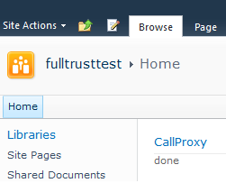

This blogpost describes the problems that could have come up when upgrading sandbox solutions to fulltrust solutions and how i Tested it. Read the conclusion in the end for the pitfalls that have to be taken care of.

At the insurance company that I work, Achmea, one the responsibilities that I have include the SP2010 guidelines. One of those guidelines is:

- use Sandbox solutions.

of course this is a guideline, which has some "unless"  clauses, because the possibilities for custom solutions would be very smart then.

Some of those clauses are:

- unless generic components are deployed
- unless performance will be an issue
- unless the solution is not possible without full trust soltions
- ...

Point is, we want to use sandbox solutions _where possible_, with various reasons to underpin this guideline, such as our future roadmap, solution management, platform management, version management etc. One big reason is to be able to see all available features that are rolled out via full trust solutions, which is not the case with sandboxes. However, that is not what this blogpost is about ;)

Whenever a sandbox solution has been deployed, is in use by various different site collections, it is possible that it is needed to promote this sandbox solution to a full trust solution. This is generally when one of the "unless"  clauses has been met. Let's say that a solution exists, which will be promoted to a generic component. This component will be made available everywhere by deploying this solution as a full trust solution. Whenever I was overthinking this situation, some issues came up into my mind:

- Is the installation even possible, whenever sandbox solutions with the same solution ID and features with the same feature ID exist?
- If this installation is possible, what solution does have a higher prio? Sandbox over Full trust, or the other way around?
- Can a full trust proxy make use of SPProxyOperations that are registred via the user code service?
- What about versions?
    - What happend whenever a site collection contains a version 1.0 of a solution, while version 2.0 will be promoted to a sandbox
    - Will the features be upgraded?
    - What about the customers?

I tested this by creating two visual studio projects. The full trust solution, that is called by the full trust proxy, was left behind, because I just returned a default value. In this case I just wanted to find out whether or not a full trust proxy can be called from the sandbox

- FullTrustProxy
    - proxyOperations
        - always returns "done";
    - proxyArguments
    - feature receiver that installs this proxy
- SandBox
    - Contains a webpart, which calls the proxy with some arguments and displays the proxy operation result.

These solutions where deployed and my webpart displayed "done" on the screen:

After this action, I modified the sandbox solution on 2 places:

- changed the sandbox solution property in visual studio 2010 to false
- Added a line in the Render method of the webpart:  writer.Write("converted full trust solution:  ");

After deploying this solution, my webpart displayed the correct text. After removing the full trust solution, the original value was displayed.

The second part that I wanted to investigate, was about feature upgrades. I kept my initial sandbox solution, updated the feature to version 2.0.0.0, added some upgrade actions and deployed it again as a full trust solution. Using [Chris O' Brien's Feature Upgrade Kit](http://spfeatureupgrade.codeplex.com/) I checked whether or not my features could be upgraded or not. This was _not_ the case.

I don't know yet what the impact is for features that contain content types and things like that, but will test this out in the future. I can imagine that this _does_ have some impact.

**Conclusion:**

The issues that I thought of, were no real issues:

- Installing a solution whenever a sandbox solution exists, is possible
- Full trust solutions do have higher prio over sandbox solutions.
- Full trust solutions can make use of the full trust proxy operations, although this isn't via the user code service, but directly via the assembly in the GAC.
- Features already existing in sandbox solutions cannot be upgraded through this full trust solution!

The biggest issue is the issue of the business:

Whenever an old sandbox solution (v1.0) has been deployed to a site with certain functionality, and a newer(v5) full trust solution will be deployed across the farm, this can have some impact on the business: It's possible that the business is going to miss functionality that resided in v1.0 and is not available in v5.0.
