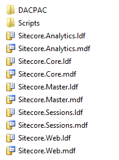
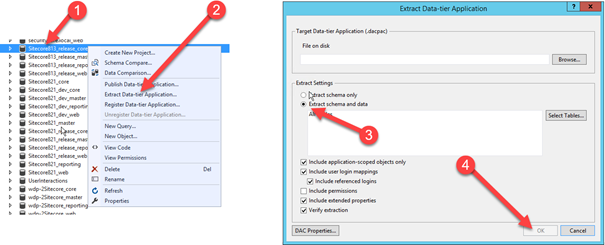

Let’s face it: a lot of customers won’t deploy to Azure immediately, but will have a migration to Azure on their roadmap for the next year. It’s wise prepare as much as possible to make the transition smooth. This blogpost shows off how what the differences between the current Azure and classic on-premises are and how to create custom web deploy packages for your on premise environments, to be in line with a possible future upgrade to Azure. It will make your local deployments repeatable while making use of Microsoft standards. Additional advantage: Your (initial) deployments may happen faster!

See the video below where I explained what I did

<iframe src="https://www.youtube.com/embed/nULkrrK2HuA" width="480" height="270" frameborder="0" allowfullscreen="allowfullscreen"></iframe>

# The biggest difference between classic deployments and Azure

In classic deployments we do recognize the /data, /database and /website folders in the root of IIS. This choice was made in the past to be sure to keep the /data folder not accessible via IIS. In Azure, however, this is not possible: the choice has been made to move this /data folder into the /App\_data. This will also be the “new” location of your license.xml. Some 3rd party modules, such as Unicorn, also have their data-storage in /data, these should be moved to /App\_data as well.

# Preparations: Create dacpac files for your databases

In the past, we had to manually attach the databases to SQL before Sitecore could be enrolled. With Sitecore 8.2.1 Sitecore also delivers dacpac files to deploy databases. A new directory, called DACPAC, has been added to the database folder in the Sitecore site root folder. This DACPAC isn’t used while executing a “classic on-premise” deployment, only when deploying to Azure.

_DAC is A data-tier application (DAC), a logical database management entity that defines all of the SQL Server objects - like tables, views, and instance objects, including logins – associated with a user’s database. A DAC is a self-contained unit of SQL Server database deployment that enables data-tier developers and database administrators to package SQL Server objects into a portable artifact called a DAC package, also known as a DACPAC._

This technique can be used on premises as well, even with older versions of Sitecore. The only thing that is missing are the DACPAC files, but they can easily be created:

- Install a fresh Sitecore instance (with the version that you want to deploy using web deploy)
- Open up visual studio
- Connect to the database using SQL Server object explorer
- Right click on the database that needs to be exported as a DACPAC
- Make sure to select “Extract Schema and Data”
- Export
- Repeat this for all four databases

# Create a Web deploy package

The following steps have been extensively explaind in [my previous blogpost](http://blog.baslijten.com/sitecore-on-azure-create-custom-web-deploy-packages-using-the-sitecore-azure-toolkit/), so I will go rather quickly through it.

As this will be a web deploy package used for on premise deployments, no cloud cargo payloads are needed. This means that new configurations have to be created. Pre 8.2.1-packages are lacking DACPAC files and this deployment setup needs a datafolder change, thus a new cargo payload has to be created for this setup. As the cherry on the Apple sauce (a dutch saying, which means: “The icing on the cake”) the Sitecore 8.2.1 technique to set the admin password during setup will be included as well!

## Create the cargo payload

The first step is to create  a new cargo payload which contains the DACPAC files, the SQL script to set the admin password, the patchfile for the datafolder and the license.xml. With the ARM templates in Azure this license.xml can be provisioned, but I didn’t find a way to dynamically include this license.xml in web deploy packages yet. A cargo payload with the following files and structure has to be created:

- CopyToRoot
    - Core.dacpac
    - Web.dacpac
    - Master.dacpac
    - Reporting.dacpac
    - sql
- CoptyToWebsite
    - App\_Config
        - Include
            - config (with \\App\_data as datafolder)
        - App\_Data
            - xml

Run the New-SCCargoPayload command to create the sccpl and you’re good to go.

## Create the custom config file for your web deploy package

I created two new configuration files: one common.config and one singleRole.config which are used to create the web deploy package. No Sitecore.Cloud references should be left in heren, only the BasLijten.SIngleRole.sccpl should be included. In these files it’s possible to make different configurations for different roles!

## Alter the archive.xml and parameters.xml

The archive.xml and parameters.xml will be copied into the web deploy package by the tooling. I copied an archive.xml and removed the entries of some .sql files that aren’t available. The parameters.xml defines what parameters are required to provision the application. An example is the following snippet:

3 parameter entries are defined. Each Parameter entry tells what to look for (ProviderPath, XmlFile, Textfile), what to look for and what to do.

- Sitecore Admin New password – replace the PlaceHolderForPassword string in the SetSitecoreAdminPassword.sql
- Core Admin Connection String – make sure that the Sitecore.Core.dacpac gets provisioned to this database and execute SetSitecoreAdminPassword.sql on this database. As the PlaceHJolderForPassword was replaced by the provided password, the new password will be stored in the database. “Bye Bye b” :D.
- Core Connection String: replace the core connectionstring by the provided value in the XML file “connectionstrings.config”

The complete parameters.xml that I used can be found on Github.

## Create the actual package

The last step that needs to be taken is to run the Start-SitecoreAzurePackaging command (as described in my previousblog) which creates the new Web deploy package for Sitecore 8.1.3

# Deploy Sitecore using webdeploy

At this point, a Sitecore webdeploy package with the 8.1.3 database dacpac files, the Sitecore root, the license.xml, datafolder patchfile has been created. All you need to do, is to create a setparameters.xml which provides all (required) parameters and start provisioning:

The next step is to deploy using the following batchfile:

Conclusion Creating a custom web deploy package for an older version of Sitecore isn’t hard, it basically just needs the DACPAC files and a patchfile. This makes deploying to your on premises environments a blast and lets you use the same tooling and techniques for your on premise installation as well for azure.
