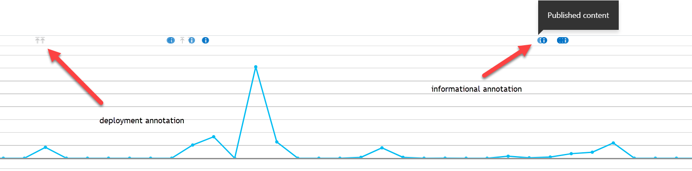
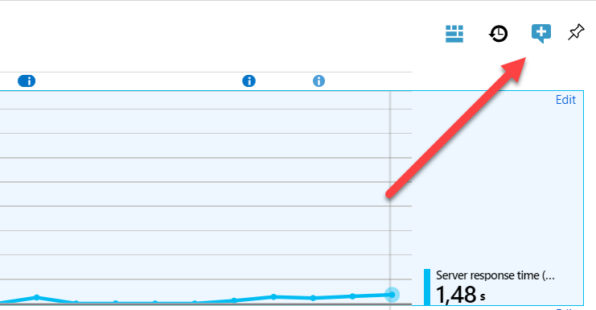
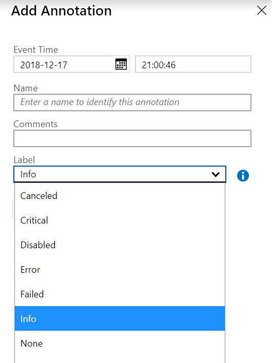
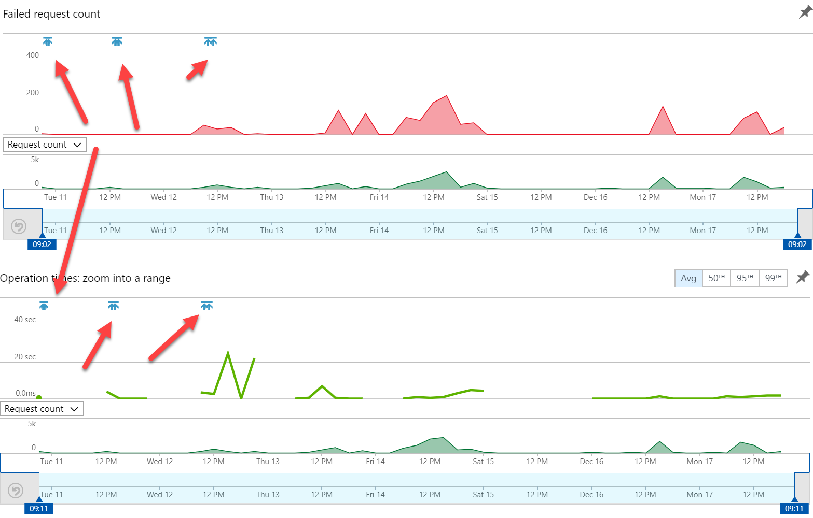
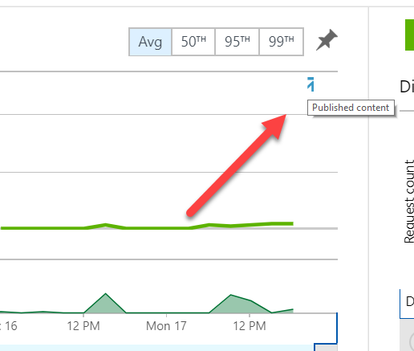

Recently I discovered the possibility of adding notes to specific point s in time on the application insights classic metrics. This is a very interesting way of marking specific, important events in your application lifecycle, for example, deployments. It turns out, that an Azure DevOps extension exists to mark application deployments, This might be a point in time where your applications starts to behave differently, due to a bug or new functionality. These events may arise from your application as well. An interesting event could be the time of publishing content in a Content Management System, as it might influence the behaviour of your web application. This blogpost explains how to use annotations in application insights and the things that don't work (yet)

Source code can be found here

## What are annotations and how do they work?

To start with the drawbacks: Annotations _only_ work in the classic metric explorer; they don't show up in the new metrics yet. These annotations are small icons in the timeline, containing a certain message and specific icon.

From the UI, those annotations can be made:

and this button gives the possibility to specify a date and time, a name, a comment and a label:

From this list, one specific annotation type is missing: The deployment annotation. Deployment annotations are indicated by the small arrows in the first image of this blogpost.

## Using annotations in the Failure and Performance overview

In the "new" Application Insights, these deployment annotations can be found in the failure and performance overview, which means that Microsoft marks them as important events in the application lifecycle:

 

All the other events, which can be added manually from the UI, don't show up in this overview, and as far as I know, no filters can be applied to add other markers as well. In our specific situation, we had to need to add markers in this timeline. We are working with the content management system "Sitecore", which has different roles, each being deployed to different application services. Certain events, such as publishing content, _might_ have effect on the performance of the content delivery role (the web application that serves content to visitors); that's why these events needed to be marked. As the only visible annotation was the deployment annotation _and_ that one was not useable from the UI we had to create some code to create this annotation.

## How to create annotations within your application

I couldn't find any information about the API, but luckily, Microsoft [created some powershell for this two years ago.](https://azure.microsoft.com/nl-nl/blog/application-insights-powershell-script-available-for-creating-release-annotations/) All I had to do was to convert this code into C#. In my code repository I created [a class "Annotations"](https://github.com/BasLijten/sitecore-application-insights-annotations/blob/master/src/Feature/Annotations/code/Annotations.cs) which does the heavy lifting.

From the application, everything that needs to be done is executing the following code:

\[code languagie="csharp"\] var annotation = new Annotations(); annotation.CreateAnnotation("Published content", AICategory.Deployment); \[/code\]

In this specific example, a deployment annotation with the title "Published content" will be made, as shown in the previous image.

## Summary

Altough annotations don't work in the new metric overview and only deployment annotations are shown in the new application insights Failure and Performance overview, it can be of great use to mark (very) important events in your application lifecycle. This API helps to do the heavy lifiting and add annotations in a very convenient way.
