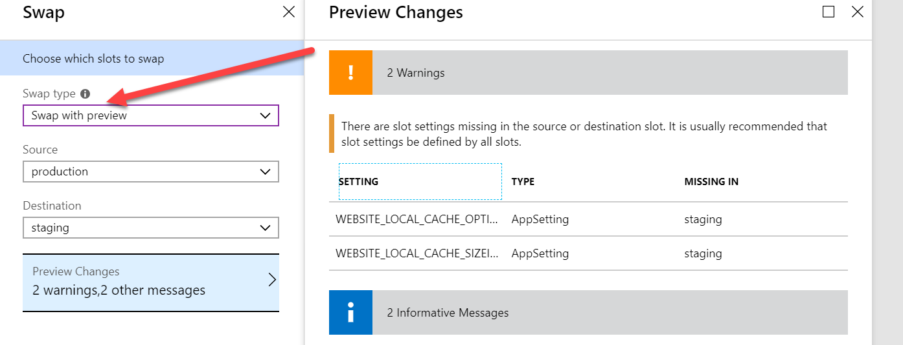

Using deployment slots in Azure App Services is a best practice to deploy Sitecore your application with zero downtime. However, there are some drawbacks, for example when slot specific settings are being used. This blogpost describes how to come around these issues.

When using a [blue-green deployment](https://www.robhabraken.nl/index.php/2740/blue-green-sitecore-deployments-on-azure/) zero downtime deployments can be realized for Sitecore. However, when making use of slot specific settings, this may lead to at least stuttering of your application(s). At the moment that a slot is swapped, the _slot specific_ application settings are being transferred to the application, which causes the application to recycle.

In my [previous blogpost](https://blog.baslijten.com/increase-your-sitecore-performance-by-enabling-the-local-cache-on-azure-app-services/) I wrote about slot specific settings, which enables a fast local cache of the filesystem. As this increased speed is a very nice improvement, the application recycle has to be prevented or it has to be solved in another way.

## Default Azure mechanics - swap with preview

A mechanism that should be used, is to use the "Swap with preview" option. This option recycles your application and loads the slot specific settings of your target slot into your app domain, which means; it's ready to use on production. However, in this swap with preview option, you don't have a guaranteed warmed up application: swapping to fast means that your application might stutter when it hasn't been fully loaded yet.

## Use application Initialization for a guaranteed warmup

As described in a [previous blogpost, the application initialization](https://blog.baslijten.com/warmup-your-application-on-azure-app-service-when-scaling-up-and-swapping-slots-using-application-initialization/) configuration can be used to define pages that need to be initialized when recycling an application. Azure does have mechanism when scaling up and swapping slots (with preview) to have a guarateed warmup of those pages: After the configured pages have been loaded, the application will be added to the pool, or will be ready for swap (with preview)

## Summary

While swapping slots is a best practice to achieve zero downtime, it does have some drawbacks, for example when working with slot specific settings. Using application initialization and the Swap with preview method will circumvent this shortcoming and deliver a true zero downtime experiene.
