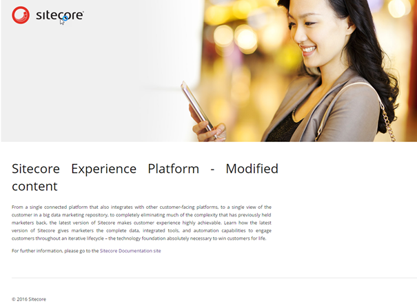
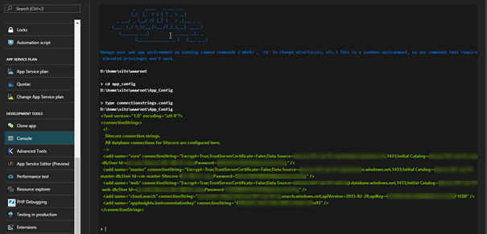
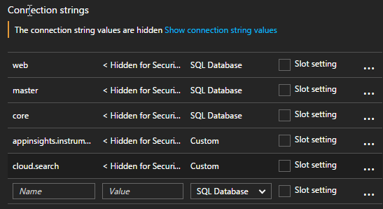
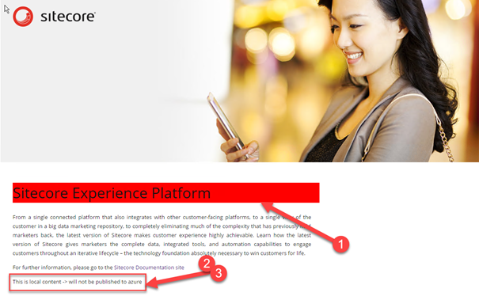
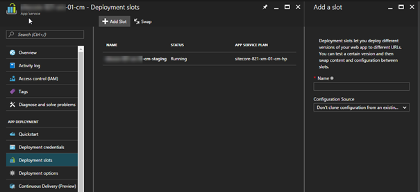
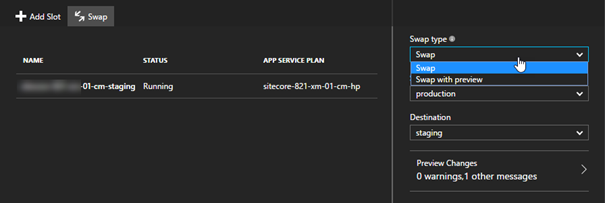

From a business perspective, downtime is not desirable, _ever._ And if possible, you want to deploy as often as possible, even multiple times a day Maybe even 50 times a day for complex multi-instance  environments. And _if_ there would be any downtime, that should be during nights, as most visitors would be asleep at that time. From a technical perspective, deployments should occur during business hours: all the developers and administrators are working during these hours, thus issues (if any) could be resolved as every engineer would be available.

We all know about this story, but how many organizations _really_ implement this scenario? This blogpost will show what challenges exist when deploying web applications and how easy it is to implement zero downtime for Sitecore on Azure. The move to Azure not only opens up [opportunities for automatic scaling](http://sitecore.robhabraken.nl/index.php/2622/sitecore-8-2-1-on-azure-web-apps/) (please make sure to watch his video as well!), but also offers possibilities for enhanced continuity! This blog post does not show off how to integrate with Visual Studio Team Services and Microsoft Release Manager, that will probably be a future topic. Don’t want to read? Watch this video!

<iframe src="https://www.youtube.com/embed/GO_NHowtCko" width="1280" height="720" frameborder="0" allowfullscreen="allowfullscreen"></iframe>

As this blogposts is quite technical, here are some links of the basic fundamentals

- My blogposts on the Sitecore Azure toolkit which explain Cargopayloads, configs and how to create own web deploy packages
    - [Sitecore 8.2 update 1: Azure deployments, ARM, Web deploy and the Sitecore Azure Toolkit](http://blog.baslijten.com/sitecore-8-2-update-1-azure-deployments-arm-web-deploy-and-the-sitecore-azure-toolkit/)
    - [Sitecore on Azure: Create custom web deploy packages using the Sitecore Azure toolkit](http://blog.baslijten.com/sitecore-on-azure-create-custom-web-deploy-packages-using-the-sitecore-azure-toolkit/)
    - [Use the Sitecore Azure toolkit to deploy your on premises environment](http://blog.baslijten.com/use-the-sitecore-azure-toolkit-to-deploy-your-on-premises-environment/)
- [Sitecore 8.2-1 on Azure Web Apps](http://sitecore.robhabraken.nl/index.php/2622/sitecore-8-2-1-on-azure-web-apps/)
- [ARM Deep dive on pluralsight](https://www.pluralsight.com/courses/azure-resource-manager-deep-dive)
- [Web deploy](https://www.iis.net/downloads/microsoft/web-deploy)

# Provisioning vs Deployment

**Provisioning** usually means that the infrastructure will be set up for a new application, including all dependencies. **Deployment** is the process of putting a new application, or a new version of an application onto a pre-provisioned environment. How does this compare to Azure Resource Manager (ARM) templates that Sitecore provided? The ARM template _provisions_ the azure infrastructure and in these ARM templates the web deploy packages are referenced to _deploy_ the first version of your application.

During a deployment lifecycle the infrastructure shouldn’t be reprovisioned, only the new application needs to be  deployed to the environment, while _not_ re-deploying the databases, as it would reset all content to the initial state: all user generated content would be deleted.

This blogpost focuses on the part where provisioning stops: application deployment. The starting point is a provisioned Sitecore XP xM1 infrastructure (Content Delivery and Content Management) in Azure, with modified, user generated content:

# Deploying an Application – Potential Issues

Deploying an application from Visual Studio is not too hard, [see this blogpost by Johannes Zuilstra](https://trayek.wordpress.com/2016/12/06/deploying-code-to-sitecore-on-paas/) on this subject. However, a repeatable and stable deployment within your continuous delivery/deployment process could be another story. What if you are deleting files from your solution? Deploying Web deploy packages does not retract these files: it a) removes the complete website root or, b) adds new files and alters existing files. So how should cases like these be handled? Especially when working with Unicorn, this is a problem. Another issue is the downtime issue: adding new content will trigger an application pool recycle which conflicts with the zero downtime requirement. It seems that we have two objectives:

- A stable deployment
- Deployment without downtime

## Stable deployment – redeploy Sitecore _and_ your application

At Achmea, we always completely redeploy our application: this means cleaning up the website root, re-deploy Sitecore and deploy the application on top of that fresh Sitecore installation. This way we make sure that no “old files” will remain and that we are always working with the latest version of our Sitecore baseline and application.

The same pattern can be used in the cloud:

- Clean the website root
- Deploy a Sitecore web deploy package
- Deploy your application

There is, however, a big disadvantage when using the default Sitecore web deployment packages: they deploy a new database including content (dacpac) and require a LOT of parameters, including the database connection strings, application insights keys and a lot of other parameters, which are usually provided by the ARM templates.

When this package will be deployed, all parameters need to be provided, otherwise the deployment will fail. But what is the value of the connectionstrings? What is the serviceURL of the cloud search parameter? And if these parameters are known and provided, then the deployment of this package will recreate the databases; something that shouldn’t happen as well. The user generated content (“Sitecore Experience platform – Modified content”) would be lost. The first step to work towards zero downtime, is to solve these issues.

## Another way of Configuring Connection Strings in Azure

This is important information to work towards zero downtime deployments. In the current approach, the connectionstrings are stored in the connectionstrings.config, which means that they need to be redeployed for each deployment:

\[caption id="attachment\_19871" align="alignnone" width="605"\] Thanks Rob Habraken for showing off this neat little trick! Navigate to Development tools\\console to see what’s actually installed on your app service!\[/caption\]

However, Azure offers an alternative way of storing connection string values as well! Navigate to the Application settings where an app settings and connection settings can be found. When entering connection strings here, these settings will be used _over_ the settings specified in the Connectionstrings.config. They are persistent as well, so after a removal of _all_ the content in your app service, these Connection strings are still valid. This also means that a new deployment of your application, without Connection strings, will still work. This also means that those parameters aren’t needed anymore at deployment time.

\[caption id="attachment\_19881" align="alignnone" width="547"\] It’s also possible to enable “slot setting” – Slots will be explained later in this article.\[/caption\]

## Deploy the application – not the database

As seen in the parameters.xml, there are a lot of references to the dacpacs and custom SQL scripts, which all need input as well. As those databases already have been installed during the provisioning of the application, all those references can be removed.

## Challenge + workaround - license.xml

The snippet above doesn’t show the license.xml – with a reason. Deploying the license.xml using the setparameters.xml, seems to be hard: I wasn’t able to include the licenseXML value yet, which means that another solution had to be found. For the time being a solution with a custom cargo payload containing the license will do, although it’s not a nice solution.

# Create a new web deploy package for _deployment_

From the 22 initial parameters that were needed, 16 have been removed. The snippet below shows a stripped parameters.xml that can be used after the initial provisioning.

This parameters.xml only needs the necessary input for application deployments.

How those packages can be created is described in my previous blog posts::

- [Sitecore on Azure: Create custom web deploy packages using the SItecore Azure toolkit](http://blog.baslijten.com/sitecore-on-azure-create-custom-web-deploy-packages-using-the-sitecore-azure-toolkit/)
- [Use the Sitecore Azure toolkit to deploy your on premises environment](http://blog.baslijten.com/use-the-sitecore-azure-toolkit-to-deploy-your-on-premises-environment/)

_Note: The dacpac files can’t be removed from the web deploy packages using the Sitecore Azure Toolkit – they are put in when the first package is created. For now, I didn’t investigate how to remove them easily – I left them in the package._

# Deploy to Azure using PowerShell

As mentioned before, I saw some great blogposts on how to deploy your customizations to the cloud using Visual Studio. This is great during development time, but I wouldn’t recommend to do this when working towards continuous delivery. Aside from that you can’t deploy web deploy packages using visual Studio.  [Christof Claessens](https://twitter.com/xstof?lang=nl) provided a [nice script](https://github.com/xstof/Quiz/blob/04-addarm/deploy/deploy-webappcode-api.ps1) on how to use web deploy from the commandline. This script had to be slightly modified to deploy the web deploy package, since this script builds the solution first, there was a problem with the contentPath used and I had to include the setparameters.xml to supply my 6 parameters. Below, my modified script can be found:

This will start the web deploy from the command line towards Azure. Let’s see what happens:

- the web app becomes unresponsive and even may throw some errors.
- After the deployment, the cache needs to be build up; there is no warmup of the pool
- There are no connection strings specified in the ConnectionStrings.config:
- \[caption id="attachment\_19901" align="alignnone" width="605"\] The connectionstring values are default values, as they appear in the default installation files\[/caption\]
- After warmup, we do see a working website, with the changed content in place:

Objective 1: check – a working website, is accomplished, which still preserving the user generated content. No passwords, usernames or connection strings were provided, while the website still works. A new “vanilla” Sitecore web deploy package was created and deployed. The next step is to deploy a new application. This can be done in various ways

- Deploy two packages: the vanilla Sitecore package using msdeploy and deploy your _changes_ (application) using web deploy using visual studio. (I don’t recommend this from a continuous deployment perspective, but I will use this in my screencast and my blogpost)
- Deploy two packages: the vanilla Sitecore web deploy package and an application web deploy package
- Deploy one web deploy package: Use the Sitecore Azure toolkit to create a cargo payload for your application(s) and build a new web deploy package, including the Sitecore root.

_Note: I am not sure what scenario I like the most, scenario 2 or 3. While developing/testing, scenario 2 might be the best as creating a full new package using the Sitecore toolkit takes quite some time , from a Continuous delivery perspective scenario 3 has a lot of advantages._

To “prove” that new applications can be deployed, a new solution has been created. Three changes have been made:

- The default.css has slightly been modified: the contentTitle class got a red background.
- The “sample item” template got an extra field: “note” (via Unicorn. The reason why this tool was used over TDS will become clear later in this blogpost)
- The “sample rendering XSLT” has been modified to show the “note” content

These changes result in a few files that can be deployed using web deploy: the CSS, the XSLT and the serialized data in yml format. This results in the following, astonishing beautiful look & feel:

\[caption id="attachment\_19921" align="alignnone" width="605"\] Note: Unicorn was already added in my Sitecore baseline (as a cargo payload, similar to the way I added Sitecore Powershell Extensions to my baseline in [this post](http://blog.baslijten.com/sitecore-on-azure-create-custom-web-deploy-packages-using-the-sitecore-azure-toolkit/)), so only the Unicorn configuration for my application had to be added to my project.\[/caption\]

# Deployment without downtime – meet the deployment slots!

The next objective is to deploy a new application without downtime and errors. In Azure, it’s possible to use “deployment slots“. These slots are separate web applications with their own configuration, their own website root and their own publishing profiles. They can be used to test your changes, before deploying the application to the production stage. As seen in the image below, a “staging” slot has already been created:

These slots provide the possibility of cloning the configuration sources (the app and connection strings). Remember the “enable/disable” slot settings? When enabled, they are specific to the slot they are configured in, when not the settings will be copied along with the application. In this example the settings are not slot specific, which means that those settings are clone: the same core, master and web databases will be used.

_Note: When having slot specific settings, your application will get a cold start!_

After testing the staging environment and the official acceptance by business owners, a “swap” can be executed. Both a direct swap and a swap with preview are possible:

“Swap” leads to a direct swap of web applications: your staging environment becomes production and vice versa.

“Swap with preview” does basically the same, but leaves a moment to cancel the swap before the slots get swapped (this is demonstrated in the video as well). It does exactly the same as a direct swap, but doesn’t switch load balancers yet.

_Note: these actions can be triggered from Microsoft Release Manager as well, for a fully automated deployment!!_

_Note2: I learned from [Rob Habraken](http://sitecore.robhabraken.nl/) that staging slots can freely be used in the Sitecore perpetual server based license model._

When the project has been deployed to the staging environment, the environment can be validated, tested and warmed up. After a swap, the new, provisioned application is available to everyone!

Objective 2: Zero downtime deployments – accomplished!

# Convenient Roll back with Unicorn

Earlier in this article was stated that I wanted to use Unicorn. When rolling back deployments, it’s important to roll back the filesystem _and_ the deployed applicative content. With Sitecore, this is only possible by

- Restoring SQL backups for the core, master and web database – this causes downtime
- Deploying a new Sitecore package – simply restoring the old package will probably not cut it

With Unicorn, the “old” situation is still available in the deployment slot (after swapping). By simply syncing that content and swapping the application back to production, the roll back is executed – no deployment of old web packages is involved in this process.

# Conclusion

It’s not too hard to set up a small environment to deploy without downtime, and have a very convenient rollback scenario without downtime. However, there are some drawbacks, which can be overcome, but some work is needed

- Sitecore offers ARM templates to provision Sitecore with an initial deployment
- The web deploy packages that are offered by Sitecore cannot be used for redeployment, as they recreate the Sitecore databases. The parameters provided also require the use of parameters that should be provided once.
    - This leads to “initial deployment” or “provisioning” web deploy packages and “deployment” web deploy packages. This leads to extra work when altering baselines and: custom archive.xml’s, parameter.xml’s and configuration files.

Apart from the drawbacks, I am _very_ enthusiastic on the possibilities for Sitecore on Azure: convenient ALM, scaling, zero downtime. This is definitely going to help towards a continuous deployment scenario. Happy Azureing (is that a word? ;))

PS: Special thanks to [Rob Habraken](http://sitecore.robhabraken.nl/), [Christof Claessens](https://twitter.com/xstof?lang=nl), [Pete Navarra](https://sitecorehacker.com/), [Sean Holmesby](http://www.seanholmesby.com/) and [George Chang](https://github.com/georgechang) for their reviews
